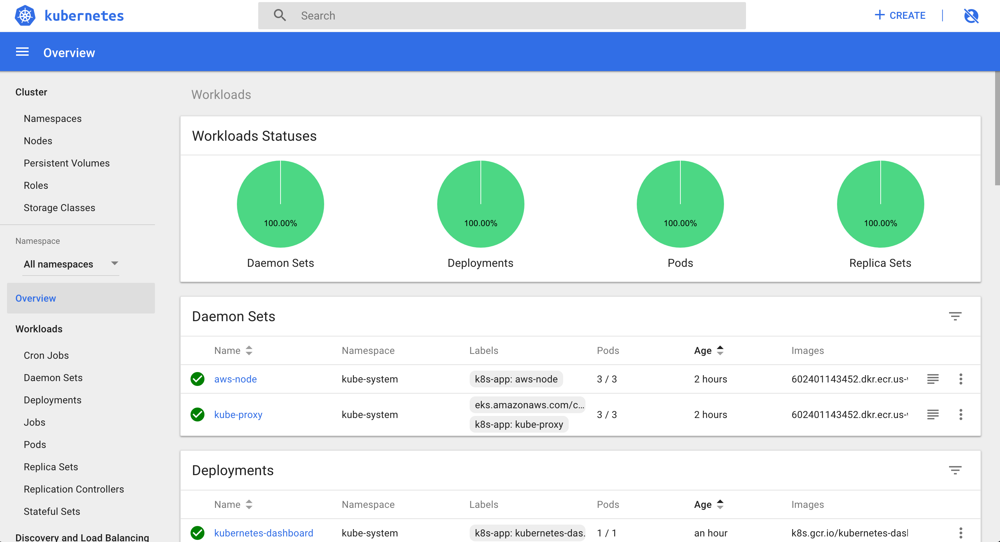
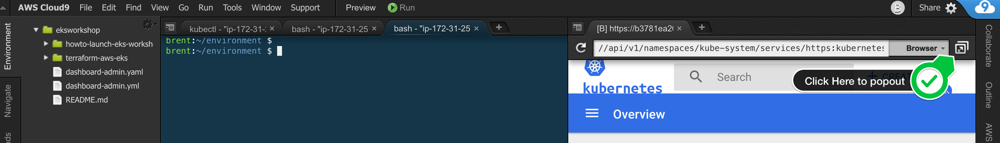

# 초보자

## KUBERNETES 대시보드 배포

이 장에서는 공식 Kubernetes 대시보드를 배포하고 Cloud9 Workspace를 통해 연결합니다.



## 공식 KUBERNETES 대시보드 배포
공식 Kubernetes 대시보드는 기본적으로 배포되지 않지만 다음 지침이 있습니다. [공식 문서](https://kubernetes.io/docs/tasks/access-application-cluster/web-ui-dashboard/)

다음 명령을 사용하여 대시보드를 배포할 수 있습니다.

```
export DASHBOARD_VERSION="v2.0.0"

kubectl apply -f https://raw.githubusercontent.com/kubernetes/dashboard/${DASHBOARD_VERSION}/aio/deploy/recommended.yaml
```

이것은 개인 클러스터에 배포되므로 프록시를 통해 액세스해야 합니다. kube-proxy대시보드 서비스에 대한 요청을 프록시하는 데 사용할 수 있습니다. 작업 공간에서 다음 명령을 실행합니다.

```
kubectl proxy --port=8080 --address=0.0.0.0 --disable-filter=true &
```

이것은 프록시를 시작하고, 포트 8080에서 수신 대기하고, 모든 인터페이스에서 수신 대기하고, 비 localhost 요청의 필터링을 비활성화합니다.

이 명령은 현재 터미널 세션의 백그라운드에서 계속 실행됩니다.

XSRF 공격으로부터 보호하는 보안 기능인 요청 필터링을 비활성화합니다. 프로덕션 환경에서는 권장되지 않지만 개발 환경에서는 유용합니다.

## 대시보드에 액세스
이제 Kubernetes 대시보드에 액세스할 수 있습니다.

1. Cloud9 환경에서 도구 / 미리보기 / 실행 중인 애플리케이션 미리보기를 클릭합니다.

2. URL 끝까지 스크롤하여 다음을 추가합니다.

```
/api/v1/namespaces/kubernetes-dashboard/services/https:kubernetes-dashboard:/proxy/
```

Cloud9 미리보기 브라우저는 토큰 인증을 지원하지 않는 것으로 보이므로, Cloud9 미리보기 브라우저 탭에 로그인 화면이 있으면 팝업 버튼을 눌러 아래와 같이 일반 브라우저 탭에서 로그인 화면을 엽니다.



새 터미널 탭을 열고 다음을 입력하십시오.

```
aws eks get-token --cluster-name eksworkshop-eksctl | jq -r '.status.token'
```

이 명령의 출력을 복사한 다음 토큰 옆에 있는 라디오 버튼을 클릭한 다음 아래 텍스트 필드에 마지막 명령의 출력을 붙여넣습니다.


그런 다음 로그인을 누릅니다.

## 대청소
프록시 중지 및 대시보드 배포 삭제

```
# kill proxy
pkill -f 'kubectl proxy --port=8080'

# delete dashboard
kubectl delete -f https://raw.githubusercontent.com/kubernetes/dashboard/${DASHBOARD_VERSION}/aio/deploy/recommended.yaml

unset DASHBOARD_VERSION
```
