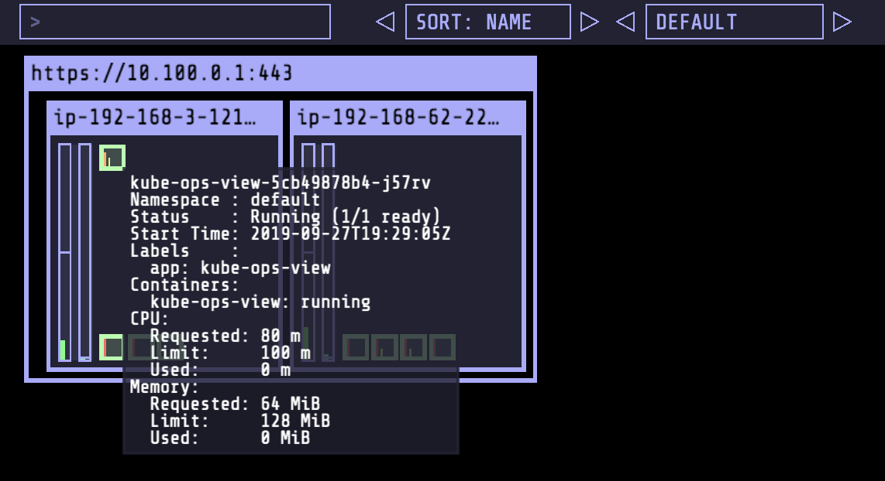
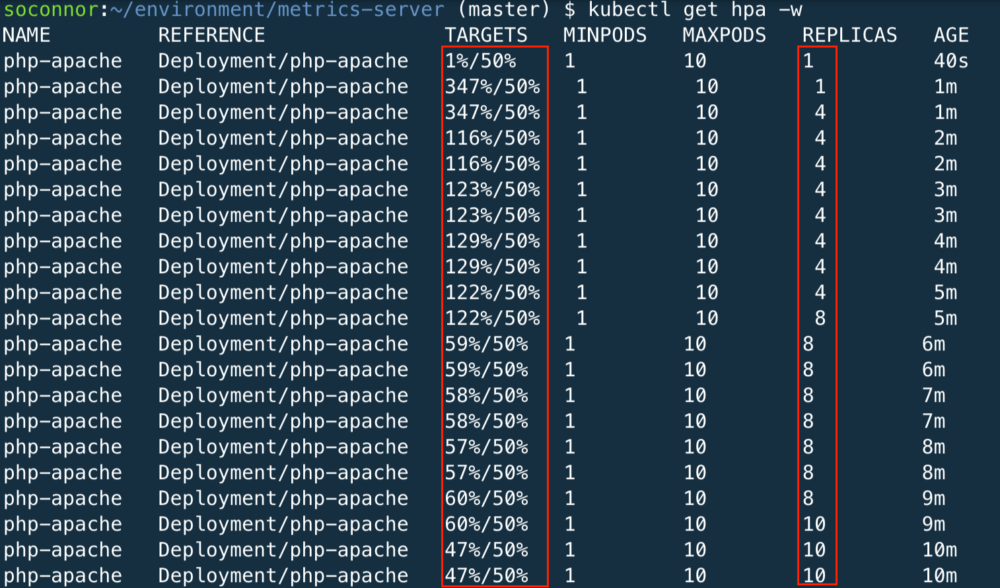
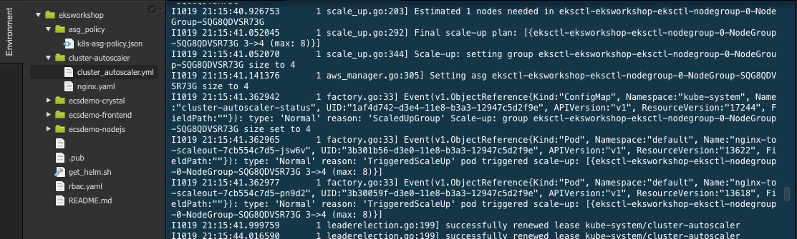
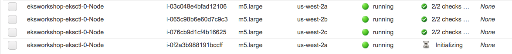

# HPA 및 CA로 AUTOSCALING 구현

이 장에서는 작업자 노드 및 애플리케이션 배포를 자동으로 확장하는 패턴을 보여줍니다.

K8의 자동 크기 조정은 두 가지 형태로 제공됩니다.

HPA(Horizontal Pod Autoscaler) 는 배포 또는 복제본 세트의 포드를 확장합니다. K8s API 리소스 및 컨트롤러로 구현됩니다. 컨트롤러 관리자는 각 HorizontalPodAutoscaler 정의에 지정된 메트릭에 대해 리소스 사용률을 쿼리합니다. 리소스 메트릭 API(포드별 리소스 메트릭의 경우) 또는 사용자 지정 메트릭 API(다른 모든 메트릭의 경우)에서 메트릭을 가져옵니다.

클러스터 오토스케일러(CA) 는 쿠버네티스 클러스터의 크기를 자동으로 조정하여 모든 포드가 실행할 장소를 갖고 불필요한 노드가 없도록 하는 구성요소입니다.

## KUBE-OPS-VIEW 설치

EKS 클러스터에 대한 다양한 자동 크기 조정 옵션에 대해 알아보기 전에 설치할 것입니다. [큐브 작업 보기](https://github.com/hjacobs/kube-ops-view) \~에서 [헤닝 제이콥스](https://github.com/hjacobs) . Kube-ops-view는 클러스터 설정을 시각적으로 이해하는 데 도움이 되는 Kubernetes 클러스터에 대한 일반적인 운영 그림을 제공합니다.

```
우리는 Helm이전에 구성한 것을 사용하여 kube-ops-view를 배포할 것입니다.기준 치수
```

다음 줄은 안정적인 helm 리포지토리를 업데이트한 다음 LoadBalancer 서비스 유형을 사용하여 kube-ops-view를 설치하고 읽기 전용 서비스 계정에 대한 RBAC(Resource Base Access Control) 항목을 생성하여 클러스터에서 노드 및 포드 정보를 읽습니다.

```
helm install kube-ops-view \
stable/kube-ops-view \
--set service.type=LoadBalancer \
--set rbac.create=True
```

위의 실행은 kube-ops-view를 설치하여 LoadBalancer 유형을 사용하여 서비스를 통해 노출합니다. 명령을 성공적으로 실행하면 생성된 리소스 세트가 표시 kubectl proxy되고 서비스에 대한 로컬 URL과 사용을 묻는 몇 가지 조언이 표시 됩니다. 서비스에 LoadBalancer 유형을 사용하고 있으므로 이를 무시할 수 있습니다. 대신 브라우저가 외부 로드 밸런서를 가리키도록 합니다.

```
모니터링 및 시각화는 일반적으로 서비스가 적절하게 보호되고 인증 및 권한 부여 방법을 제공하지 않는 한 공개적으로 노출되어서는 안 됩니다. 섹션 을 제거 하고 를 사용하여 ClusterIP 유형의 서비스를 사용하여 kube-ops-view를 계속 배포할 수 있습니다 . Kube-ops-view는 또한--set service.type=LoadBalancerkubectl [proxy지원 Oauth 2](https://github.com/hjacobs/kube-ops-view#configuration)
```

차트가 성공적으로 설치되었는지 확인하려면:

```
helm list
```

다음을 표시해야 합니다.

```
NAME            REVISION        UPDATED                         STATUS          CHART                   APP VERSION     NAMESPACE
kube-ops-view   1               Sun Sep 22 11:47:31 2019        DEPLOYED        kube-ops-view-1.1.0     0.11            default  
```

이를 통해 새로 생성된 서비스에 대한 세부 정보를 확인하여 kube-ops-view 출력을 탐색할 수 있습니다.

```
kubectl get svc kube-ops-view | tail -n 1 | awk '{ print "Kube-ops-view URL = http://"$4 }'
```

그러면 Kube-ops-view URL = http://\<URL\_PREFIX\_ELB>.amazonaws.com 브라우저에서 URL 을 열면 클러스터의 현재 상태가 제공되는 것과 유사한 줄이 표시 됩니다.

```
페이지를 새로 고치고 브라우저 캐시를 정리해야 할 수도 있습니다. LoadBalancer 생성 및 설정에는 몇 분이 소요될 수 있습니다. 일반적으로 2분 안에 kub-ops-view가 표시됩니다.
```



이 워크샵이 진행되고 확장 및 축소 작업을 수행함에 따라 kube-ops-view를 사용하여 클러스터의 효과 및 변경 사항을 확인할 수 있습니다. 다양한 구성 요소를 확인하고 이 워크숍에서 이미 다룬 개념에 어떻게 매핑되는지 확인하십시오.

```
EKS 클러스터의 상태와 속성을 확인하는 데 시간을 할애하십시오.
```


## 수평형 포드 AUTOSCALER(HPA) 구성

메트릭 서버 배포 Metrics Server는 Kubernetes 기본 제공 자동 확장 파이프라인을 위한 확장 가능하고 효율적인 컨테이너 리소스 메트릭 소스입니다.

이러한 메트릭은 [배포](https://kubernetes.io/docs/concepts/workloads/controllers/deployment/).

다음을 사용하여 메트릭 서버를 배포합니다. 쿠버네티스 메트릭 서버.

```
kubectl apply -f https://github.com/kubernetes-sigs/metrics-server/releases/download/v0.4.1/components.yaml
```

메트릭 서버의 상태를 확인 APIService하겠습니다(몇 분 정도 소요될 수 있음).

```
kubectl get apiservice v1beta1.metrics.k8s.io -o json | jq '.status'
```

```
{
  "conditions": [
    {
      "lastTransitionTime": "2020-11-10T06:39:13Z",
      "message": "all checks passed",
      "reason": "Passed",
      "status": "True",
      "type": "Available"
    }
  ]
}
```

이제 배포된 애플리케이션을 확장할 준비가 되었습니다.

## HPA로 애플리케이션 확장

### 샘플 앱 배포

애플리케이션을 배포하고 TCP 포트 80에서 서비스로 노출합니다.

응용 프로그램은 php-apache 이미지를 기반으로 하는 맞춤형 이미지입니다. index.php 페이지는 CPU 부하를 생성하기 위해 계산을 수행합니다. 더 많은 정보를 찾을 수 있습니다여기

```
kubectl create deployment php-apache --image=us.gcr.io/k8s-artifacts-prod/hpa-example
kubectl set resources deploy php-apache --requests=cpu=200m
kubectl expose deploy php-apache --port 80

kubectl get pod -l app=php-apache
```

### HPA 리소스 만들기

이 HPA는 CPU가 할당된 컨테이너 리소스의 50%를 초과하면 확장됩니다.

```
kubectl autoscale deployment php-apache `#The target average CPU utilization` \
    --cpu-percent=50 \
    --min=1 `#The lower limit for the number of pods that can be set by the autoscaler` \
    --max=10 `#The upper limit for the number of pods that can be set by the autoscaler`
```

kubectl을 사용하여 HPA를 봅니다. 아마 /50%1-2분 동안 볼 수 있을 것입니다.0%/50%

```
kubectl get hpa
```

### 확장을 트리거하는 부하 생성

Cloud9 환경에서 새 터미널 을 열고 다음 명령을 실행하여 새 컨테이너의 셸에 드롭합니다.

```
kubectl --generator=run-pod/v1 run -i --tty load-generator --image=busybox /bin/sh
```

while 루프를 실행하여 http:///php-apache를 계속 가져옵니다.

```
while true; do wget -q -O - http://php-apache; done
```

이전 탭에서 다음 명령으로 HPA를 확인합니다.

```
kubectl get hpa -w
```

CPU 평균이 목표(50%) 미만이 될 때까지 HPA가 포드를 1에서 구성된 최대값(10)까지 확장하는 것을 볼 수 있습니다.



이제 다른 터미널에서 실행 중이던 부하 테스트를 중지( Ctrl + C ) 할 수 있습니다 . HPA가 구성에 따라 복제본 수를 최소 수로 천천히 가져오는 것을 알 수 있습니다. 또한 Ctrl + D 를 눌러 부하 테스트 응용 프로그램을 종료해야 합니다 .

## 클러스터 자동 확장 처리(CA) 구성

AWS용 Cluster Autoscaler는 Auto Scaling 그룹과의 통합을 제공합니다. 이를 통해 사용자는 4가지 배포 옵션 중에서 선택할 수 있습니다.

* Auto Scaling 그룹 1개
* 여러 Auto Scaling 그룹
* 자동 검색
* 제어 평면 노드 설정

자동 검색은 클러스터 자동 확장 처리를 구성하는 데 선호되는 방법입니다. 딸깍 하는 소리여기 자세한 내용은.

Cluster Autoscaler는 시작 구성 또는 시작 템플릿에 지정된 인스턴스 유형을 기반으로 Auto Scaling 그룹에서 제공하는 CPU, 메모리 및 GPU 리소스를 결정하려고 시도합니다.

### ASG 구성

최소, 최대, 원하는 용량을 설정하여 Auto Scaling 그룹의 크기를 구성합니다. 클러스터를 생성할 때 이 설정을 3으로 설정했습니다.

```
aws autoscaling \
    describe-auto-scaling-groups \
    --query "AutoScalingGroups[? Tags[? (Key=='eks:cluster-name') && Value=='eksworkshop-eksctl']].[AutoScalingGroupName, MinSize, MaxSize,DesiredCapacity]" \
    --output table
```

```
-------------------------------------------------- -----------
| DescribeAutoScalingGroups |
+----------------------------------------------------------+----+ --+-----+
| eks-1eb9b447-f3c1-0456-af77-af0bbd65bc9f | 3 | 3 | 3 |
+----------------------------------------------------------+----+ --+-----+
```

이제 최대 용량을 4개의 인스턴스로 늘리십시오.

```
# we need the ASG name
export ASG_NAME=$(aws autoscaling describe-auto-scaling-groups --query "AutoScalingGroups[? Tags[? (Key=='eks:cluster-name') && Value=='eksworkshop-eksctl']].AutoScalingGroupName" --output text)

# increase max capacity up to 4
aws autoscaling \
    update-auto-scaling-group \
    --auto-scaling-group-name ${ASG_NAME} \
    --min-size 3 \
    --desired-capacity 3 \
    --max-size 4

# Check new values
aws autoscaling \
    describe-auto-scaling-groups \
    --query "AutoScalingGroups[? Tags[? (Key=='eks:cluster-name') && Value=='eksworkshop-eksctl']].[AutoScalingGroupName, MinSize, MaxSize,DesiredCapacity]" \
    --output table
```

### 서비스 계정에 대한 IAM 역할

```
[여기를 클릭](https://www.eksworkshop.com/beginner/110_irsa/) IRSA(서비스 계정에 대한 IAM 역할)에 익숙하지 않은 경우.
```

Amazon EKS 클러스터의 서비스 계정에 대한 IAM 역할을 사용하여 IAM 역할을 다음과 연결할 수 있습니다. Kubernetes 서비스 계정. 그런 다음 이 서비스 계정은 해당 서비스 계정을 사용하는 모든 포드의 컨테이너에 AWS 권한을 제공할 수 있습니다. 이 기능을 사용하면 해당 노드의 포드가 AWS API를 호출할 수 있도록 더 이상 노드 IAM 역할에 확장된 권한을 제공할 필요가 없습니다.

클러스터의 서비스 계정에 대한 IAM 역할 활성화

```
eksctl utils associate-iam-oidc-provider \
    --cluster eksworkshop-eksctl \
    --approve
```

CA 포드가 자동 크기 조정 그룹과 상호 작용하도록 허용하는 서비스 계정에 대한 IAM 정책 생성.

```
mkdir ~/environment/cluster-autoscaler

cat <<EoF > ~/environment/cluster-autoscaler/k8s-asg-policy.json
{
    "Version": "2012-10-17",
    "Statement": [
        {
            "Action": [
                "autoscaling:DescribeAutoScalingGroups",
                "autoscaling:DescribeAutoScalingInstances",
                "autoscaling:DescribeLaunchConfigurations",
                "autoscaling:DescribeTags",
                "autoscaling:SetDesiredCapacity",
                "autoscaling:TerminateInstanceInAutoScalingGroup",
                "ec2:DescribeLaunchTemplateVersions"
            ],
            "Resource": "*",
            "Effect": "Allow"
        }
    ]
}
EoF

aws iam create-policy   \
  --policy-name k8s-asg-policy \
  --policy-document file://~/environment/cluster-autoscaler/k8s-asg-policy.json
```

마지막으로 kube-system 네임스페이스에서 cluster-autoscaler 서비스 계정에 대한 IAM 역할을 생성합니다.

```
eksctl create iamserviceaccount \
    --name cluster-autoscaler \
    --namespace kube-system \
    --cluster eksworkshop-eksctl \
    --attach-policy-arn "arn:aws:iam::${ACCOUNT_ID}:policy/k8s-asg-policy" \
    --approve \
    --override-existing-serviceaccounts
```

IAM 역할의 ARN이 있는 서비스 계정에 주석이 추가되었는지 확인합니다.

```
kubectl -n kube-system describe sa cluster-autoscaler
```

산출

```
Name:                cluster-autoscaler
Namespace:           kube-system
Labels:              <none>
Annotations:         eks.amazonaws.com/role-arn: arn:aws:iam::197520326489:role/eksctl-eksworkshop-eksctl-addon-iamserviceac-Role1-12LNPCGBD6IPZ
Image pull secrets:  <none>
Mountable secrets:   cluster-autoscaler-token-vfk8n
Tokens:              cluster-autoscaler-token-vfk8n
Events:              <none>
```

### 클러스터 자동 확장 처리(CA) 배포

다음 명령을 사용하여 클러스터에 클러스터 자동 확장 처리를 배포합니다.

```
kubectl apply -f https://www.eksworkshop.com/beginner/080_scaling/deploy_ca.files/cluster-autoscaler-autodiscover.yaml
```

CA가 자체 포드가 실행 중인 노드를 제거하는 것을 방지하기 위해 cluster-autoscaler.kubernetes.io/safe-to-evict다음 명령을 사용하여 배포에 주석을 추가합니다.

```
kubectl -n kube-system \
    annotate deployment.apps/cluster-autoscaler \
    cluster-autoscaler.kubernetes.io/safe-to-evict="false"
```

마지막으로 자동 크기 조정 이미지를 업데이트하겠습니다.

```
# we need to retrieve the latest docker image available for our EKS version
export K8S_VERSION=$(kubectl version --short | grep 'Server Version:' | sed 's/[^0-9.]*\([0-9.]*\).*/\1/' | cut -d. -f1,2)
export AUTOSCALER_VERSION=$(curl -s "https://api.github.com/repos/kubernetes/autoscaler/releases" | grep '"tag_name":' | sed -s 's/.*-\([0-9][0-9\.]*\).*/\1/' | grep -m1 ${K8S_VERSION})

kubectl -n kube-system \
    set image deployment.apps/cluster-autoscaler \
    cluster-autoscaler=us.gcr.io/k8s-artifacts-prod/autoscaling/cluster-autoscaler:v${AUTOSCALER_VERSION}
```

로그 보기

```
kubectl -n kube-system logs -f deployment/cluster-autoscaler
```

이제 클러스터를 확장할 준비가 되었습니다.

관련 파일

* [cluster-autoscaler-autodiscover.yaml](https://www.eksworkshop.com/beginner/080\_scaling/deploy\_ca.files/cluster-autoscaler-autodiscover.yaml) (4 Ko)

## CA로 클러스터 확장

### 샘플 앱 배포

샘플 nginx 애플리케이션 ReplicaSet을 1 부터 배포합니다.Pod

```
cat <<EoF> ~/environment/cluster-autoscaler/nginx.yaml
apiVersion: apps/v1
kind: Deployment
metadata:
  name: nginx-to-scaleout
spec:
  replicas: 1
  selector:
    matchLabels:
      app: nginx
  template:
    metadata:
      labels:
        service: nginx
        app: nginx
    spec:
      containers:
      - image: nginx
        name: nginx-to-scaleout
        resources:
          limits:
            cpu: 500m
            memory: 512Mi
          requests:
            cpu: 500m
            memory: 512Mi
EoF

kubectl apply -f ~/environment/cluster-autoscaler/nginx.yaml

kubectl get deployment/nginx-to-scaleout
```

### ReplicaSet 확장

복제 집합을 10으로 확장해 보겠습니다.

```
kubectl scale --replicas=10 deployment/nginx-to-scaleout
```

일부 포드는 Pending클러스터 자동 확장 처리를 트리거하여 EC2 집합을 확장 하는 상태가 됩니다.

```
kubectl get pods -l app=nginx -o wide --watch
```

이름 준비 상태 다시 시작 연령

```
NAME                                 READY     STATUS    RESTARTS   AGE

nginx-to-scaleout-7cb554c7d5-2d4gp   0/1       Pending   0          11s
nginx-to-scaleout-7cb554c7d5-2nh69   0/1       Pending   0          12s
nginx-to-scaleout-7cb554c7d5-45mqz   0/1       Pending   0          12s
nginx-to-scaleout-7cb554c7d5-4qvzl   0/1       Pending   0          12s
nginx-to-scaleout-7cb554c7d5-5jddd   1/1       Running   0          34s
nginx-to-scaleout-7cb554c7d5-5sx4h   0/1       Pending   0          12s
nginx-to-scaleout-7cb554c7d5-5xbjp   0/1       Pending   0          11s
nginx-to-scaleout-7cb554c7d5-6l84p   0/1       Pending   0          11s
nginx-to-scaleout-7cb554c7d5-7vp7l   0/1       Pending   0          12s
nginx-to-scaleout-7cb554c7d5-86pr6   0/1       Pending   0          12s
nginx-to-scaleout-7cb554c7d5-88ttw   0/1       Pending   0          12s
```

클러스터 자동 확장 처리 로그 보기

```
kubectl -n kube-system logs -f deployment/cluster-autoscaler
```

아래와 유사한 Cluster Autoscaler 이벤트를 확인할 수 있습니다.



을 체크 해봐 [EC2 AWS 관리 콘솔](https://console.aws.amazon.com/ec2/home?#Instances:sort=instanceId) Auto Scaling 그룹이 수요에 맞게 확장되고 있는지 확인합니다. 이 작업은 몇 분 정도 걸릴 수 있습니다. 명령줄에서 포드 배포를 따를 수도 있습니다. 노드가 확장됨에 따라 포드가 보류에서 실행으로 전환되는 것을 볼 수 있습니다.



또는 kubectl을 사용하여

```
kubectl get nodes
```

산출

```
ip-192-168-12-114.us-east-2.compute.internal   Ready    <none>   3d6h   v1.17.7-eks-bffbac
ip-192-168-29-155.us-east-2.compute.internal   Ready    <none>   63s    v1.17.7-eks-bffbac
ip-192-168-55-187.us-east-2.compute.internal   Ready    <none>   3d6h   v1.17.7-eks-bffbac
ip-192-168-82-113.us-east-2.compute.internal   Ready    <none>   8h     v1.17.7-eks-bffbac
```

## 정리 스케일링

```
kubectl delete -f ~/environment/cluster-autoscaler/nginx.yaml

kubectl delete -f https://www.eksworkshop.com/beginner/080_scaling/deploy_ca.files/cluster-autoscaler-autodiscover.yaml

eksctl delete iamserviceaccount \
  --name cluster-autoscaler \
  --namespace kube-system \
  --cluster eksworkshop-eksctl \
  --wait

aws iam delete-policy \
  --policy-arn arn:aws:iam::${ACCOUNT_ID}:policy/k8s-asg-policy

export ASG_NAME=$(aws autoscaling describe-auto-scaling-groups --query "AutoScalingGroups[? Tags[? (Key=='eks:cluster-name') && Value=='eksworkshop-eksctl']].AutoScalingGroupName" --output text)

aws autoscaling \
  update-auto-scaling-group \
  --auto-scaling-group-name ${ASG_NAME} \
  --min-size 3 \
  --desired-capacity 3 \
  --max-size 3

kubectl delete hpa,svc php-apache

kubectl delete deployment php-apache

kubectl delete pod load-generator

cd ~/environment

rm -rf ~/environment/cluster-autoscaler

kubectl delete -f https://github.com/kubernetes-sigs/metrics-server/releases/download/v0.4.1/components.yaml

kubectl delete ns metrics

helm uninstall kube-ops-view

unset ASG_NAME
unset AUTOSCALER_VERSION
unset K8S_VERSION
```
