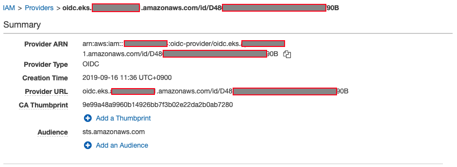

# 서비스 계정에 대한 IAM 역할

## 서비스 계정에 대한 IAM 역할

#### 서비스 계정에 대한 세분화된 IAM 역할

Kubernetes 버전 1.12에서는 서비스 계정 ID도 포함하고 구성 가능한 대상을 지원하는 OIDC JSON 웹 토큰인 새로운 ProjectedServiceAccountToken 기능 에 대한 지원이 추가되었습니다 .

이제 Amazon EKS는 ProjectedServiceAccountToken JSON 웹 토큰에 대한 서명 키가 포함된 클러스터당 공개 OIDC 검색 엔드포인트를 호스팅하므로 IAM과 같은 외부 시스템이 Kubernetes 발급 OIDC 토큰을 확인하고 수락할 수 있습니다.

OIDC 연동 액세스를 통해 STS(Secure Token Service)를 통해 IAM 역할을 맡을 수 있으며, OIDC 공급자를 통한 인증을 활성화하고 JWT(JSON 웹 토큰)를 수신하여 IAM 역할을 맡을 수 있습니다. 반면 Kubernetes는 포드에 대한 유효한 OIDC JWT인 소위 예상 서비스 계정 토큰을 발행할 수 있습니다. 우리의 설정은 포드의 ID를 설정하기 위해 선택한 OIDC 공급자에 대해 STS가 확인할 수 있는 암호화 서명된 토큰을 각 포드에 제공합니다.

새 자격 증명 공급자 "sts:AssumeRoleWithWebIdentity"

### 준비

#### 클러스터의 서비스 계정에 대한 IAM 역할 활성화

서비스 계정에 대한 IAM 역할 기능은 새로운 Amazon EKS Kubernetes 버전 1.14 클러스터와 2019년 9월 3일 또는 그 이후에 버전 1.14 또는 1.13으로 업데이트된 클러스터에서 사용할 수 있습니다.

```
EKS 클러스터 버전이 더 낮거나 위와 일치하지 않는 경우 다음을 읽으십시오. Amazon EKS 클러스터 업데이트 섹션을 참조하십시오.
```

```
kubectl version --short
```

aws cli 버전이 1.18.15보다 낮은 경우 다음을 사용하십시오. AWS CLI 설치 사용자 가이드에서

```
aws --version
```

```
aws-cli/1.18.15 Python/2.7.16 Linux/4.14.133-88.112.amzn1.x86_64 botocore/1.12.228
```

OpenID Connect 발급자 URL 검색:

```
aws eks describe-cluster --name eksworkshop-eksctl --query cluster.identity.oidc.issuer --output text
```

### OIDC ID 공급자 생성

클러스터의 서비스 계정에 IAM 역할을 사용하려면 IAM 콘솔에서 OIDC 자격 증명 공급자를 생성해야 합니다.

eksctl 버전이 0.5.1 이상인지 eksctl 버전을 확인하십시오.

```
eksctl version
```

```
[ℹ] version.Info{BuiltAt:"", GitCommit:"", GitTag:"0.5.3"}
```

eksctl 버전이 0.5.1보다 낮은 경우 다음을 사용하십시오. eksctl 설치 또는 업그레이드 사용자 가이드에서

클러스터에 대한 OIDC 자격 증명 공급자 생성

```
eksctl utils associate-iam-oidc-provider --cluster eksworkshop-eksctl --approve
```

```
[ℹ]  using region {AWS_REGION}
[ℹ]  will create IAM Open ID Connect provider for cluster "eksworkshop-eksctl" in "{AWS_REGION}"
[✔]  created IAM Open ID Connect provider for cluster "eksworkshop-eksctl" in "{AWS_REGION}"
```

에 가면 IAM 콘솔의 자격 증명 공급자, 클러스터에 대해 OIDC 공급자가 생성된 것을 볼 수 있습니다.



### 서비스 계정에 대한 IAM 역할 생성

포드의 컨테이너에 부여할 권한을 지정하는 IAM 정책을 생성합니다.

이 워크숍에서 우리는 "이라는 정책을 관리하는 AWS 사용 AmazonS3ReadOnlyAccess 허용" get및 list모두를위한 당신의 S3 버킷을.

" AmazonS3ReadOnlyAccess " 정책에 대한 ARN을 찾는 것부터 시작하겠습니다.

```
aws iam list-policies --query 'Policies[?PolicyName==`AmazonS3ReadOnlyAccess`].Arn'
```

```
"arn:aws:iam::aws:policy/AmazonS3ReadOnlyAccess"
```

이제 S3에 대한 읽기 전용 액세스 권한이 있는 서비스 계정에 바인딩된 IAM 역할을 생성합니다.

```
eksctl create iamserviceaccount \
    --name iam-test \
    --namespace default \
    --cluster eksworkshop-eksctl \
    --attach-policy-arn arn:aws:iam::aws:policy/AmazonS3ReadOnlyAccess \
    --approve \
    --override-existing-serviceaccounts
```

```
[ℹ]  using region {AWS_REGION}
[ℹ]  1 iamserviceaccount (default/iam-test) was included (based on the include/exclude rules)
[!]  metadata of serviceaccounts that exist in Kubernetes will be updated, as --override-existing-serviceaccounts was set
[ℹ]  1 task: { 2 sequential sub-tasks: { create IAM role for serviceaccount "default/iam-test", create serviceaccount "default/iam-test" } }
[ℹ]  building iamserviceaccount stack "eksctl-eksworkshop-eksctl-addon-iamserviceaccount-default-iam-test"
[ℹ]  deploying stack "eksctl-eksworkshop-eksctl-addon-iamserviceaccount-default-iam-test"
[ℹ]  created serviceaccount "default/iam-test"
```

에 가면 [IAM 콘솔의 CloudFormation](https://console.aws.amazon.com/cloudformation/), 스택 " eksctl-eksworkshop-eksctl-addon-iamserviceaccount-default-iam-test "가 서비스 계정에 대한 역할을 생성 했음을 알 수 있습니다.

### 서비스 계정에 대한 IAM 역할 지정

이전 단계 에서 클러스터의 iam-test 라는 서비스 계정과 연결된 IAM 역할을 생성했습니다 .

먼저 서비스 계정 iam-test이 있는지 확인 합니다.

```
kubectl get sa iam-test
```

```
NAME       SECRETS   AGE
iam-test   1         5m
```

IAM 역할의 ARN이 있는 서비스 계정에 주석이 추가되었는지 확인합니다.

```
kubectl describe sa iam-test
```

```
Name:                iam-test
Namespace:           default
Labels:              <none>
Annotations:         eks.amazonaws.com/role-arn: arn:aws:iam::14xxxxxxxx84:role/eksctl-eksworkshop-eksctl-addon-iamserviceac-Role1-1PJ5Q3H39Z5M9
Image pull secrets:  <none>
Mountable secrets:   iam-test-token-5n9cb
Tokens:              iam-test-token-5n9cb
Events:              <none>
```

### 샘플 포드 배포

이제 필요한 모든 구성을 완료했으므로 두 개의 kubernetes를 실행할 것입니다. 직업 새로 생성된 IAM 역할:

* job-s3.yaml : 명령의 결과를 출력합니다 aws s3 ls(이 작업은 성공해야 함).
* job-ec2.yaml : 명령의 결과를 출력합니다 aws ec2 describe-instances --region ${AWS\_REGION}(이 작업은 실패해야 함).

#### S3 버킷 나열

서비스 계정이 S3 버킷을 나열할 수 있는지 테스트하여 시작하겠습니다.

```
mkdir ~/environment/irsa

cat <<EoF> ~/environment/irsa/job-s3.yaml
apiVersion: batch/v1
kind: Job
metadata:
  name: eks-iam-test-s3
spec:
  template:
    metadata:
      labels:
        app: eks-iam-test-s3
    spec:
      serviceAccountName: iam-test
      containers:
      - name: eks-iam-test
        image: amazon/aws-cli:latest
        args: ["s3", "ls"]
      restartPolicy: Never
EoF

kubectl apply -f ~/environment/irsa/job-s3.yaml
```

작업이 완료 되었는지 확인

```
kubectl get job -l app=eks-iam-test-s3
```

```
NAME              COMPLETIONS   DURATION   AGE
eks-iam-test-s3   1/1           2s         21m
```

명령이 성공적으로 실행되었는지 확인하기 위해 로그를 확인하겠습니다.

```
kubectl logs -l app=eks-iam-test-s3
```

출력 예

```
2020-04-17 12:30:41 eksworkshop-eksctl-helm-charts
2020-02-12 01:48:05 eksworkshop-logs
```

```
출력이 있는 경우 "EC2 인스턴스 나열"로 이동하십시오.
```

```
출력이 비어 있으면 계정에 s3 버킷이 없을 수 있습니다. 이 추가 명령을 실행해 보십시오.
```

S3 버킷을 생성해 보겠습니다.

```
aws s3 mb s3://eksworkshop-$ACCOUNT_ID-$AWS_REGION --region $AWS_REGION
```

출력 예

```
make_bucket: eksworkshop-886836808448-us-east-1
```

이제 그 작업을 다시 시도해 보겠습니다.

1. 기존 작업을 삭제합니다.

```
kubectl delete job -l app=eks-iam-test-s3
```

작업을 다시 생성할 수 있습니다.

```
kubectl apply -f ~/environment/irsa/job-s3.yaml
```

마지막으로 출력을 볼 수 있습니다.

```
kubectl logs -l app=eks-iam-test-s3
```

출력 예

```
2021-05-17 15:44:41 eksworkshop-886836808448-us-east-1
```

#### EC2 인스턴스 나열

이제 서비스 계정이 EC2 인스턴스를 나열할 수 없는지 확인하겠습니다.

```
cat <<EoF> ~/environment/irsa/job-ec2.yaml
apiVersion: batch/v1
kind: Job
metadata:
  name: eks-iam-test-ec2
spec:
  template:
    metadata:
      labels:
        app: eks-iam-test-ec2
    spec:
      serviceAccountName: iam-test
      containers:
      - name: eks-iam-test
        image: amazon/aws-cli:latest
        args: ["ec2", "describe-instances", "--region", "${AWS_REGION}"]
      restartPolicy: Never
  backoffLimit: 0
EoF

kubectl apply -f ~/environment/irsa/job-ec2.yaml
```

작업 상태를 확인하자

```
kubectl get job -l app=eks-iam-test-ec2
```

```
NAME               COMPLETIONS   DURATION   AGE
eks-iam-test-ec2   0/1           39s        39s
```

작업이 성공적으로 완료되지 않은 것은 정상입니다.

마지막으로 우리는 로그를 검토할 것입니다

```
kubectl logs -l app=eks-iam-test-ec2
```

산출

```
An error occurred (UnauthorizedOperation) when calling the DescribeInstances operation: You are not authorized to perform this operation.
```

## CLEAN UP

정리하려면 다음 단계를 따르세요.

```
kubectl delete -f ~/environment/irsa/job-s3.yaml
kubectl delete -f ~/environment/irsa/job-ec2.yaml

eksctl delete iamserviceaccount \
    --name iam-test \
    --namespace default \
    --cluster eksworkshop-eksctl \
    --wait

rm -rf ~/environment/irsa/

aws s3 rb s3://eksworkshop-$ACCOUNT_ID-$AWS_REGION --region $AWS_REGION --force
```
