# 네트워크 정책으로 클러스터 보호

이 장에서는 두 가지 도구를 사용하여 네트워크 정책을 사용한 다음 클러스터의 네트워크 정책을 EKS 보안 그룹과 통합함으로써 클러스터를 보호할 것입니다.

먼저 우리가 사용할 [프로젝트 칼리코](https://www.projectcalico.org) 클러스터에서 Kubernetes 네트워크 정책을 시행하여 다양한 마이크로서비스를 보호합니다.

그 후에 우리는 [칼리코 엔터프라이즈](https://www.tigera.io/tigera-products/calico-enterprise) NS 사용할 것입니다

* EKS 워크로드가 다른 Amazon 서비스(예: RDS 또는 EC2 인스턴스) 또는 다른 API 엔드포인트와 통신할 수 있도록 송신 액세스 제어를 구현합니다.
* 서로 통신할 수 없는 마이크로 서비스 문제 해결
* EKS의 엔터프라이즈 보안 제어 구현 및 보고


## CALICO를 사용하여 네트워크 정책 생성

이 장에서는 다음을 사용하여 몇 가지 네트워크 정책을 만듭니다. [옥양목](https://www.projectcalico.org) 그리고 실제로 적용되는 규칙을 확인하세요.

네트워크 정책을 사용하면 서로 다른 서비스 간에 흐를 수 있는 트래픽 유형을 결정하는 규칙을 정의할 수 있습니다. 네트워크 정책을 사용하여 트래픽을 제한하는 규칙을 정의할 수도 있습니다. 이는 클러스터의 보안을 향상시키는 수단입니다.

예를 들어 애플리케이션에서 프런트엔드에서 백엔드로의 트래픽만 허용할 수 있습니다.

네트워크 정책은 네임스페이스 내에서 트래픽을 격리하는 데도 도움이 됩니다. 예를 들어 개발 및 프로덕션을 위한 별도의 네임스페이스가 있는 경우 동일한 네임스페이스 내에서 포드 간 통신을 제한하여 둘 사이의 트래픽 흐름을 방지할 수 있습니다.


## 칼리코 설치

다음에서 Calico 매니페스트를 적용합니다. [aws/amazon-vpc-cni-k8s GitHub 프로젝트](https://github.com/aws/amazon-vpc-cni-k8s). 그러면 kube-system 네임스페이스에 데몬 세트가 생성됩니다.

```
kubectl apply -f https://raw.githubusercontent.com/aws/amazon-vpc-cni-k8s/master/config/v1.6/calico.yaml
```

Calico 매니페스트의 몇 가지 주요 기능을 살펴보겠습니다.

1. 우리는 전체에 주석을 봅니다. [주석](https://kubernetes.io/docs/concepts/overview/working-with-objects/annotations/) 비식별 메타데이터를 개체 에 첨부하는 방법 입니다. 이 메타데이터는 Kubernetes에서 내부적으로 사용되지 않으므로 k8 내에서 식별하는 데 사용할 수 없습니다. 대신 외부 도구 및 라이브러리에서 사용됩니다. 주석의 예로는 빌드/릴리스 타임스탬프, 디버깅을 위한 클라이언트 라이브러리 정보 또는 이 경우 Calico와 같은 네트워크 정책에서 관리하는 필드가 있습니다.

```
kind: DaemonSet
apiVersion: apps/v1
metadata:
  name: calico-node
  namespace: kube-system
  labels:
    k8s-app: calico-node
spec:
  selector:
    matchLabels:
      k8s-app: calico-node
  updateStrategy:
    type: RollingUpdate
    rollingUpdate:
      maxUnavailable: 1
  template:
    metadata:
      labels:
        k8s-app: calico-node
      annotations:
        # This, along with the CriticalAddonsOnly toleration below,
        # marks the pod as a critical add-on, ensuring it gets
        # priority scheduling and that its resources are reserved
        # if it ever gets evicted.
        *scheduler**.alpha.kubernetes.io/critical-pod: ''*
        ...
```

대조적으로, 라벨Kubernetes 에서 개체에 대한 식별 속성 을 지정 하는 데 사용됩니다 . 선택기 쿼리 또는 레이블 선택기와 함께 사용됩니다. Kubernetes에서 내부적으로 사용하기 때문에 쿼리를 최적화하기 위해 키와 값의 구조가 제한됩니다.

1. 매니페스트에 tolerations 속성이 있음을 알 수 있습니다. [오염 및 관용](https://kubernetes.io/docs/concepts/configuration/taint-and-toleration/) 포드가 부적절한 노드에 예약되지 않도록 함께 작업합니다. taint는 노드에 적용되며 taint를 허용할 수 있는 유일한 포드는 해당 노드에서 실행할 수 있습니다.

taint는 키, 값 및 효과로 구성되며 다음과 같을 수 있습니다.

* PreferNoSchedule: 오염된 노드에 허용되지 않는 포드를 예약하지 않는 것을 선호합니다.
* NoSchedule: 오염된 노드에 허용되지 않는 포드를 예약하지 마십시오.
* NoExecute: 예약하지 않는 것 외에도 노드에서 이미 실행 중인 허용되지 않는 포드도 축출합니다.

taint와 마찬가지로 tolerations에도 연산자가 추가되어 키 값 쌍과 효과가 있습니다. 여기 Calico 매니페스트에서 tolerations에는 하나의 속성만 있는 것을 볼 수 있습니다 . Operator = exist . 즉, 키 값 쌍이 생략되고 허용 오차가 모든 오염과 일치하여 모든 노드에서 실행되도록 합니다.

```
 tolerations:
      - operator: Exists
```

kube-system 데몬 세트를 관찰하고 calico-node 데몬 세트가 READY 상태의 DESIRED 수의 포드를 가질 때까지 기다립니다.

```
kubectl get daemonset calico-node --namespace=kube-system
```

예상 출력:

```
NAME          DESIRED   CURRENT   READY   UP-TO-DATE   AVAILABLE   NODE SELECTOR   AGE
calico-node   3         3         3       3            3           <none>          38s
```

## Star Policy 데모

이 하위 장에서는 EKS 클러스터에서 프론트엔드, 백엔드, 클라이언트 및 UI 서비스를 생성하고 이러한 서비스 간의 통신을 허용하거나 차단하는 네트워크 정책을 정의합니다. 이 데모에는 각 서비스 간에 사용 가능한 수신 및 송신 경로를 표시하는 관리 UI도 있습니다.

## 리소스 생성

네트워크 정책을 생성하기 전에 필요한 리소스를 생성해 보겠습니다.

구성 파일에 대한 새 폴더를 만듭니다.

```
mkdir ~/environment/calico_resources
cd ~/environment/calico_resources
```

Star 네임스페이스 다음 명령을 복사하여 Cloud9 터미널에 붙여넣습니다.

```
cd ~/environment/calico_resources
wget https://eksworkshop.com/beginner/120_network-policies/calico/stars_policy_demo/create_resources.files/namespace.yaml
```

cat namespace.yaml 를 실행하여 파일을 살펴보겠습니다.

```
kind: Namespace
apiVersion: v1
metadata:
  name: stars
```

stars라는 네임스페이스를 만듭니다.

```
kubectl apply -f namespace.yaml
```

우리는 프론트엔드와 백엔드를 만들 것입니다 배포 그리고 서비스 이후 단계에서 이 네임스페이스에서.

다음 명령을 복사하여 Cloud9 터미널에 붙여넣습니다.

```
cd ~/environment/calico_resources
wget https://eksworkshop.com/beginner/120_network-policies/calico/stars_policy_demo/create_resources.files/management-ui.yaml
wget https://eksworkshop.com/beginner/120_network-policies/calico/stars_policy_demo/create_resources.files/backend.yaml
wget https://eksworkshop.com/beginner/120_network-policies/calico/stars_policy_demo/create_resources.files/frontend.yaml
wget https://eksworkshop.com/beginner/120_network-policies/calico/stars_policy_demo/create_resources.files/client.yaml
```

```
cat management-ui.yaml
```

```
apiVersion: v1
kind: Namespace
metadata:
  name: management-ui
  labels:
    role: management-ui
---
apiVersion: v1
kind: Service
metadata:
  name: management-ui
  namespace: management-ui
spec:
  type: LoadBalancer
  ports:
  - port: 80
    targetPort: 9001
  selector:
    role: management-ui
---
apiVersion: apps/v1
kind: Deployment
metadata:
  name: management-ui
  namespace: management-ui
spec:
  replicas: 1
  selector:
    matchLabels:
      role: management-ui
  template:
    metadata:
      labels:
        role: management-ui
    spec:
      containers:
      - name: management-ui
        image: calico/star-collect:v0.1.0
        imagePullPolicy: Always
        ports:
        - containerPort: 9001
```

해당 네임스페이스 내에서 management-ui 서비스 및 배포를 사용하여 management-ui 네임스페이스를 생성합니다.

```
kubectl apply -f management-ui.yaml
```

cat backend.yaml 백엔드 서비스가 어떻게 구축되는지 확인하려면 다음 안내를 따르세요.

```
apiVersion: v1
kind: Service
metadata:
  name: backend
  namespace: stars
spec:
  ports:
  - port: 6379
    targetPort: 6379
  selector:
    role: backend
---
apiVersion: apps/v1
kind: Deployment
metadata:
  name: backend
  namespace: stars
spec:
  replicas: 1
  selector:
    matchLabels:
      role: backend
  template:
    metadata:
      labels:
        role: backend
    spec:
      containers:
      - name: backend
        image: calico/star-probe:v0.1.0
        imagePullPolicy: Always
        command:
        - probe
        - --http-port=6379
        - --urls=http://frontend.stars:80/status,http://backend.stars:6379/status,http://client.client:9000/status
        ports:
        - containerPort: 6379
```

다음을 사용하여 프론트엔드 서비스를 살펴보겠습니다 cat frontend.yaml.

```
apiVersion: v1
kind: Service
metadata:
  name: frontend
  namespace: stars
spec:
  ports:
  - port: 80
    targetPort: 80
  selector:
    role: frontend
---
apiVersion: apps/v1
kind: Deployment
metadata:
  name: frontend
  namespace: stars
spec:
  replicas: 1
  selector:
    matchLabels:
      role: frontend
  template:
    metadata:
      labels:
        role: frontend
    spec:
      containers:
      - name: frontend
        image: calico/star-probe:v0.1.0
        imagePullPolicy: Always
        command:
        - probe
        - --http-port=80
        - --urls=http://frontend.stars:80/status,http://backend.stars:6379/status,http://client.client:9000/status
        ports:
        - containerPort: 80
```

stars 네임스페이스 내에 프론트엔드 및 백엔드 배포 및 서비스를 생성합니다.

```
kubectl apply -f backend.yaml
kubectl apply -f frontend.yaml
```

마지막으로 클라이언트 네임스페이스와 배포를 위한 클라이언트 서비스가 어떻게 구축되는지 살펴보겠습니다. cat client.yaml:

```
kind: Namespace
apiVersion: v1
metadata:
  name: client
  labels:
    role: client
---
apiVersion: apps/v1
kind: Deployment
metadata:
  name: client
  namespace: client
spec:
  replicas: 1
  selector:
    matchLabels:
      role: client
  template:
    metadata:
      labels:
        role: client
    spec:
      containers:
      - name: client
        image: calico/star-probe:v0.1.0
        imagePullPolicy: Always
        command:
        - probe
        - --urls=http://frontend.stars:80/status,http://backend.stars:6379/status
        ports:
        - containerPort: 9000
---
apiVersion: v1
kind: Service
metadata:
  name: client
  namespace: client
spec:
  ports:
  - port: 9000
    targetPort: 9000
  selector:
    role: client
```

클라이언트 구성을 적용합니다.

```
kubectl apply -f client.yaml
```

상태를 확인하고 모든 Pod가 Running 상태에 도달할 때까지 기다립니다.

```
kubectl get pods --all-namespaces
```

출력은 다음과 같아야 합니다.

```
NAMESPACE       NAME                                                  READY   STATUS    RESTARTS   AGE
client          client-nkcfg                                          1/1     Running   0          24m
kube-system     aws-node-6kqmw                                        1/1     Running   0          50m
kube-system     aws-node-grstb                                        1/1     Running   1          50m
kube-system     aws-node-m7jg8                                        1/1     Running   1          50m
kube-system     calico-node-b5b7j                                     1/1     Running   0          28m
kube-system     calico-node-dw694                                     1/1     Running   0          28m
kube-system     calico-node-vtz9k                                     1/1     Running   0          28m
kube-system     calico-typha-75667d89cb-4q4zx                         1/1     Running   0          28m
kube-system     calico-typha-horizontal-autoscaler-78f747b679-kzzwq   1/1     Running   0          28m
kube-system     kube-dns-7cc87d595-bd9hq                              3/3     Running   0          1h
kube-system     kube-proxy-lp4vw                                      1/1     Running   0          50m
kube-system     kube-proxy-rfljb                                      1/1     Running   0          50m
kube-system     kube-proxy-wzlqg                                      1/1     Running   0          50m
management-ui   management-ui-wzvz4                                   1/1     Running   0          24m
stars           backend-tkjrx                                         1/1     Running   0          24m
stars           frontend-q4r84                                        1/1     Running   0          24m
```

필요한 모든 Docker 이미지를 다운로드하는 데 몇 분 정도 걸릴 수 있습니다.

우리가 만든 다양한 리소스를 요약하면 다음과 같습니다.

* Stars 이라는 이름 공간
* stars 네임스페이스 내의 프론트엔드 및 백엔드 배포 및 서비스
* management-ui 라는 네임스페이스
* management-ui 네임스페이스 에서 브라우저에 표시되는 사용자 인터페이스에 대한 배포 및 서비스 management-ui
* 클라이언트 라는 네임스페이스
* 클라이언트 의 배포 및 서비스 클라이언트 네임 스페이스

## 기본 포드 간 통신

Kubernetes에서 팟( Pod)은 기본적으로 상주 하는 호스트에 관계없이 다른 팟( Pod) 과 통신할 수 있습니다 . 모든 포드에는 고유한 IP 주소가 있으므로 포드 간에 링크를 명시적으로 생성할 필요가 없습니다. 이것은 management-ui 에 의해 입증됩니다 .

```
kind: Service
metadata:
  name: management-ui
  namespace: management-ui
spec:
  type: LoadBalancer
  ports:
  - port: 80
    targetPort: 9001
```

관리 UI를 열려면 다음을 사용하여 관리 UI의 DNS 이름을 검색합니다.

```
kubectl get svc -o wide -n management-ui
```

출력에서 EXTERNAL-IP 를 복사하고 브라우저에 붙여넣습니다. EXTERNAL-IP 열에는 "elb.amazonaws.com"으로 끝나는 값이 포함되어 있습니다. 전체 값은 DNS 주소입니다.

```
NAME            TYPE           CLUSTER-IP     EXTERNAL-IP                                                              PORT(S)        AGE       SELECTOR
management-ui   LoadBalancer   10.100.239.7   a8b8c5f77eda911e8b1a60ea5d5305a4-720629306.us-east-1.elb.amazonaws.com   80:31919/TCP   9s        role=management-ui
```

여기의 UI는 서로 연결할 수 있는 모든 서비스의 기본 동작을 보여줍니다.

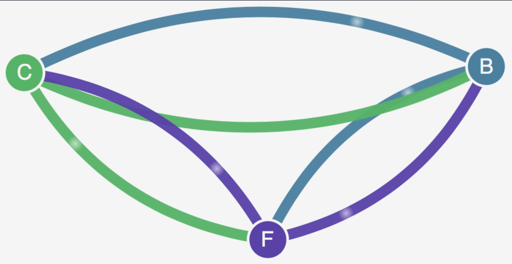

## 네트워크 정책 적용

프로덕션 수준 클러스터에서 열린 포드 대 포드 통신을 갖는 것은 안전하지 않습니다. 서비스를 서로 분리하는 방법을 살펴보겠습니다.

다음 명령을 복사하여 Cloud9 터미널에 붙여넣습니다.

```
cd ~/environment/calico_resources
wget https://eksworkshop.com/beginner/120_network-policies/calico/stars_policy_demo/apply_network_policies.files/default-deny.yaml
```

cat default-deny.yaml를 실행하여 파일을 살펴보겠습니다.

```
kind: NetworkPolicy
apiVersion: networking.k8s.io/v1
metadata:
  name: default-deny
spec:
  podSelector:
    matchLabels: {}
```

네트워크 정책을 살펴보겠습니다. 여기에서 우리는 podSelector에 matchLabels가 없고 기본적으로 모든 포드가 액세스하는 것을 차단하는 것을 볼 수 있습니다.

stars 네임스페이스(프론트엔드 및 백엔드 서비스)와 클라이언트 네임스페이스(클라이언트 서비스)에 네트워크 정책을 적용합니다 .

```
kubectl apply -n stars -f default-deny.yaml
kubectl apply -n client -f default-deny.yaml
```

브라우저를 새로 고치면 관리 UI가 노드에 연결할 수 없으므로 UI에 아무 것도 표시되지 않는 것을 볼 수 있습니다.

Kubernetes의 네트워크 정책은 레이블을 사용하여 포드를 선택하고 해당 포드에 도달할 수 있는 트래픽에 대한 규칙을 정의합니다. Ingress 또는 Egress 또는 둘 다를 지정할 수 있습니다. 각 규칙은 from 및 port 섹션 모두와 일치하는 트래픽을 허용합니다.

두 개의 새 네트워크 정책을 만듭니다.

다음 명령을 복사하여 Cloud9 터미널에 붙여넣습니다.

```
cd ~/environment/calico_resources
wget https://eksworkshop.com/beginner/120_network-policies/calico/stars_policy_demo/apply_network_policies.files/allow-ui.yaml
wget https://eksworkshop.com/beginner/120_network-policies/calico/stars_policy_demo/apply_network_policies.files/allow-ui-client.yaml
```

다시 다음을 실행하여 파일 내용을 검사할 수 있습니다. cat allow-ui.yaml

```
kind: NetworkPolicy
apiVersion: networking.k8s.io/v1
metadata:
  namespace: stars
  name: allow-ui
spec:
  podSelector:
    matchLabels: {}
  ingress:
    - from:
        - namespaceSelector:
            matchLabels:
              role: management-ui
```

cat allow-ui-client.yaml

```
kind: NetworkPolicy
apiVersion: networking.k8s.io/v1
metadata:
  namespace: client
  name: allow-ui
spec:
  podSelector:
    matchLabels: {}
  ingress:
    - from:
        - namespaceSelector:
            matchLabels:
              role: management-ui
```

### 도전:

원하는 트래픽을 허용하기 위해 네트워크 정책을 어떻게 적용합니까?

솔루션을 보려면 여기를 확장하십시오.

```
kubectl apply -f allow-ui.yaml
kubectl apply -f allow-ui-client.yaml
```

브라우저를 새로 고치면 관리 UI가 모든 서비스에 연결할 수 있지만 서로 통신할 수는 없는 것을 볼 수 있습니다.

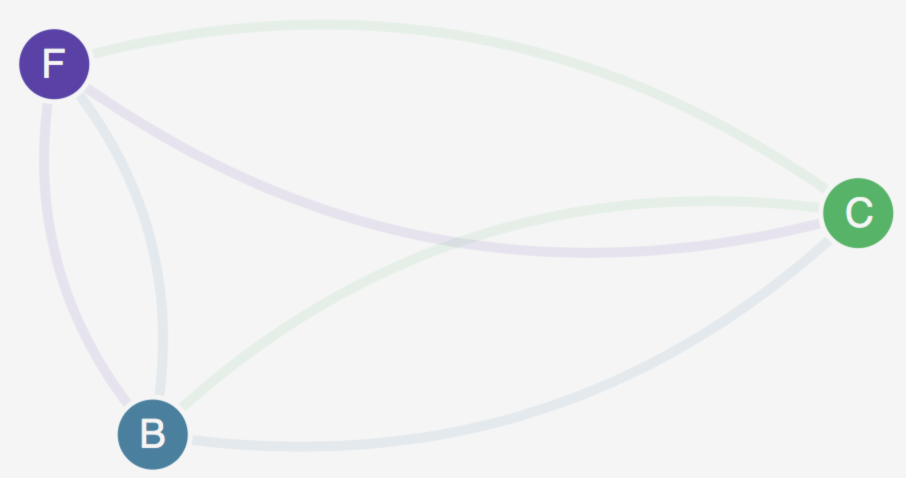

## 방향 트래픽 허용

클라이언트에서 프론트엔드로, 프론트엔드에서 백엔드로 방향성 트래픽을 허용하는 방법을 살펴보겠습니다.

다음 명령을 복사하여 Cloud9 터미널에 붙여넣습니다.

```
cd ~/environment/calico_resources
wget https://eksworkshop.com/beginner/120_network-policies/calico/stars_policy_demo/directional_traffic.files/backend-policy.yaml
wget https://eksworkshop.com/beginner/120_network-policies/calico/stars_policy_demo/directional_traffic.files/frontend-policy.yaml
```

다음을 사용하여 이 백엔드 정책을 살펴보겠습니다 cat backend-policy.yaml.

```
kind: NetworkPolicy
apiVersion: networking.k8s.io/v1
metadata:
  namespace: stars
  name: backend-policy
spec:
  podSelector:
    matchLabels:
      role: backend
  ingress:
    - from:
        - <EDIT: UPDATE WITH THE CONFIGURATION NEEDED TO WHITELIST FRONTEND USING PODSELECTOR>
      ports:
        - protocol: TCP
          port: 6379
```

도전: 매니페스트를 검토한 후 편집할 수 있도록 구성 필드 중 일부를 의도적으로 남겨 두었음을 알 수 있습니다. 제안된 대로 구성을 편집하십시오. 여기에서 유용한 정보를 찾을 수 있습니다.쿠버네티스 문서

솔루션을 보려면 여기를 확장하십시오. 다음을 사용하여 프런트엔드 정책을 살펴보겠습니다 cat frontend-policy.yaml.

```
kind: NetworkPolicy
apiVersion: networking.k8s.io/v1
metadata:
  namespace: stars
  name: frontend-policy
spec:
  podSelector:
    matchLabels:
      role: frontend
  ingress:
    - from:
        - <EDIT: UPDATE WITH THE CONFIGURATION NEEDED TO WHITELIST CLIENT USING NAMESPACESELECTOR>
      ports:
        - protocol: TCP
          port: 80
```

도전: 제안된 대로 구성을 편집하십시오. [쿠버네티스 문서](https://kubernetes.io/docs/concepts/services-networking/network-policies/) 여기에서 유용한 정보를 찾을 수 있습니다.

솔루션을 보려면 여기를 확장하십시오.

```
kind: NetworkPolicy
apiVersion: networking.k8s.io/v1
metadata:
  namespace: stars
  name: frontend-policy
spec:
  podSelector:
    matchLabels:
      role: frontend
  ingress:
    - from:
        - namespaceSelector:
            matchLabels:
              role: client
      ports:
        - protocol: TCP
          port: 80
```

프론트엔드 서비스에서 백엔드 서비스로의 트래픽을 허용하려면 다음 매니페스트를 적용하십시오.

```
kubectl apply -f backend-policy.yaml
```

그리고 클라이언트 네임스페이스에서 프런트엔드 서비스로의 트래픽을 허용합니다.

```
kubectl apply -f frontend-policy.yaml
```

브라우저를 새로 고치면 작동 중인 네트워크 정책을 볼 수 있어야 합니다.

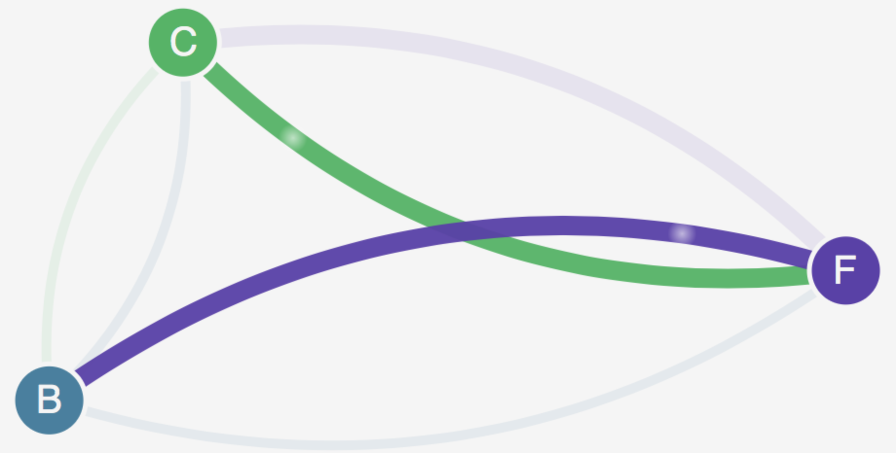

백엔드 정책을 살펴보겠습니다. 해당 사양에는 레이블이 role:backend 인 모든 포드를 선택하는 podSelector 가 있으며 레이블이 role:frontend 이고 TCP 포트 6379 가 있는 모든 포드에서 들어오는 것을 허용 하지만 반대 방향은 허용하지 않습니다. 특정 포트 번호에서 한 방향으로 트래픽이 허용됩니다.

```
spec:
  podSelector:
    matchLabels:
      role: backend
  ingress:
    - from:
        - podSelector:
            matchLabels:
              role: frontend
      ports:
        - protocol: TCP
          port: 6379
```

frontend-policy는 레이블 역할 이 TCP 포트 80의 client인 네임스페이스 로부터의 수신을 허용한다는 점을 제외하면 비슷 합니다.

```
spec:
  podSelector:
    matchLabels:
      role: frontend
  ingress:
    - from:
        - namespaceSelector:
            matchLabels:
              role: client
      ports:
        - protocol: TCP
          port: 80
```

## CLEAN UP

네임스페이스를 삭제하여 데모를 정리합니다.

```
kubectl delete namespace client stars management-ui
```

## CALICO 엔터프라이즈 사용 사례

CALICO 엔터프라이즈 사용 사례 이 모듈에서는 Tigera의 [칼리코 엔터프라이즈](https://www.tigera.io/tigera-products/calico-enterprise) 다음 3가지 Amazon EKS 사용 사례를 구현합니다.

1. 이그레스 액세스 제어 구현 Amazon EKS 클러스터 내에서 서비스 간 연결을 설정하는 것은 쉽습니다. 그러나 일부 워크로드가 클러스터 외부에 있는 Amazon RDS, ElasticCache 등과 같은 서비스에 안전하게 연결할 수 있도록 하는 방법은 무엇입니까?

Calico Enterprise를 사용하면 워크로드와 워크로드가 연결해야 하는 외부 서비스 간에 세분화된 액세스 제어를 구현하는 DNS 정책을 작성할 수 있습니다.

1. 마이크로서비스 연결 문제 해결 마이크로서비스 연결 문제를 해결하는 것은 Amazon EKS의 컨테이너 오케스트레이션의 동적 특성으로 인해 매우 어려울 수 있습니다. 연결 문제는 네트워크 성능과 관련될 수 있지만 네트워크 정책이 제대로 정의되지 않은 결과인 경우가 많습니다.

Calico Enterprise를 사용하면 서로 통신하는 모든 마이크로서비스의 시각적 표현을 탐색하고 수락 및 거부된 연결을 기준으로 필터링할 수 있습니다. 거부된 개별 연결을 자세히 분석하여 연결을 평가 및 거부한 네트워크 정책을 확인한 다음 정책을 수정하여 연결 문제를 해결할 수 있습니다.

1. 엔터프라이즈 보안 제어 구현 많은 애플리케이션에는 워크로드 격리, 개발자가 제품과 통신할 수 없도록 하거나 네트워크 영역 구현(예: DMZ는 공용 인터넷과 통신할 수 있지만 백엔드 데이터베이스는 통신할 수 없음)과 같은 규정 준수 요구 사항이 있습니다. 오픈 소스 Project Calico를 사용하여 이러한 규칙을 구현할 수 있지만 몇 가지 제한 사항이 있습니다.

다른 사용자가 실수로 보안 제어를 무시하거나 의도적으로 조작할 수 있으며 이러한 상황이 발생하면 감지하기가 매우 어렵습니다. 정책이 현재 및 과거에 시행되었다는 증거는 불가능합니다. Calico Enterprise를 사용하면 다른 사용자가 재정의할 수 없는 더 높은 우선 순위 정책 계층에서 보안 제어를 구현할 수 있습니다. 또한 정책에 대한 변경 사항을 감사(또는 경고)할 뿐만 아니라 현재 및 과거에 규정 준수를 입증하는 감사 보고서를 제공하는 방법도 배우게 됩니다.

## 등록 - CALICO ENTERPRISE 평가판에 액세스

Tigera 팀은 무료 액세스를 제공합니다. 칼리코 엔터프라이즈 에디션모든 EKSWorkshop 사용자를 위해. 아래 단계에 따라 무료 평가판을 받아 Calico Enterprise에 액세스하고 EKS 클러스터에서 직접 실행하십시오.

* 다음을 사용하여 Calico Enterprise 평가판 등록 웹사이트로 이동합니다. 이것 링크 .
* 시험 환경 세부 정보를 신속하게 받을 수 있도록 업무 이메일 주소와 함께 연락처 세부 정보를 작성하십시오.
* Kubernetes 배포판으로 Amazon EKS를 선택합니다.
* 프로모션 코드는 PAR-AWS-EKS-WORKSHOP을 사용하십시오 . EKS Workshop 사용자에 대한 평가판 요청을 자동으로 승인하는 데 사용되는 이 코드를 사용하는 것이 중요합니다.
* 서비스 약관을 검토하고 동의하고 평가판 시작 버튼을 클릭합니다.
* Tigera 팀의 누군가가 환경을 프로비저닝하고 필요한 세부 정보가 포함된 이메일을 보내드립니다. 이것은 현재 수동 프로세스이며 태평양 표준시 기준 오전 9시부터 오후 5시까지 업무 시간 동안 최대 30분이 소요될 수 있습니다. 업무 시간 외 접수된 요청은 다음 업무일에 제공됩니다.
* "Your Calico Enterprise 평가판 자격 증명"이라는 제목의 이메일을 받으면 cet@tigera.io(스팸 폴더로 이동하지 않는지 확인하십시오). 기존 EKS 클러스터에 대해 실행할 단일 명령이 제공됩니다. 이 명령은 EKS 클러스터에 필수 Calico Enterprise 구성 요소를 자동으로 설치하므로 전용 관리 포털을 사용하여 이 클러스터를 관리할 수 있습니다.
* 이메일에 제공된 지침에 따라 EKS 클러스터를 등록하고 고급 실습을 진행할 수 있습니다!

```
🐯 → curl -s https://tigera-installer.storage.googleapis.com/XXXXXXXX--management_install.sh | bash
[INFO] Checking for installed CNI Plugin
[INFO] Deploying CRDs and Tigera Operator
[INFO] Creating Tigera Pull Secret
[INFO] Tigera Operator is Available
[INFO] Adding Installation CR for Enterprise install
[WAIT] Tigera calico is Progressing
[INFO] Tigera Calico is Available
[INFO] Deploying Tigera Prometheus Operator
[INFO] Deploying CRs for Managed Cluster
[WAIT] Tigera apiserver is Progressing
[INFO] Tigera Apiserver is Available
[INFO] Generate New Cluster Registration Manifest
[INFO] Creating connection
[INFO] All Tigera Components are Available
[INFO] Securing Install

Your Connected Cluster Name is 
XXXXXXXX-us-west-2-eks-amazonaws-com

Your install was completed successfully. Below are your Calico Enterprise Credentials.

PORTAL URL: https://XXXXX-management.try.tigera.io

ACCESS TOKEN: XXXX
KIBANA USERNAME: elastic

KIBANA PASSWORD: XXXXXXXX
Lab Environment Access
  Endpoint: https://XXXXXXX.try.tigera.io:31500
  User: XXXXXXX
  Pass: XXXXXXX
```

## 정책 자동화 및 외부 액세스

## 시작하기

계속 진행하기 전에 터미널에 lab1 set\_up을 입력하여 이 실습을 위한 환경을 설정하는 것을 잊지 마십시오.

## 소개

이 실습에서는 Calico Enterprise를 활용하여 포드 수준 액세스 제어를 구현하고 개발 팀이 애플리케이션에 대한 Calico 및 Kubernetes 네트워크 정책을 쉽게 정의 및 배포할 수 있도록 하는 셀프 서비스 모델을 활성화하는 방법을 배웁니다. 이를 통해 조직은 Kubernetes 플랫폼의 네트워크 보안에 대한 제로 트러스트 접근 방식과 마이크로 세분화와 관련된 모범 사례를 보다 쉽게 ​​채택할 수 있습니다.

### 다음을 배우게 됩니다.

* 정책 계층 및 네트워크 세트를 사용하여 전체 Kubernetes 플랫폼에 대한 "가드 레일"을 정의하는 네트워크 정책을 정의하는 방법
* DNS 정책 규칙을 사용하여 특정 네임스페이스의 애플리케이션에 대한 외부 액세스를 활성화하는 방법
* Flow Visualizer를 사용하여 클러스터 내의 기존 트래픽 흐름에 대한 가시성을 확보하고 정책 권장 사항을 사용하여 정책을 권장할 워크로드를 선택하는 방법
* 정책 영향 미리 보기 및 단계적 네트워크 정책을 사용하여 클러스터 내에서 적용되기 전에 기존 정책에 대한 변경 및 새 네트워크 정책의 영향을 평가하는 방법

### 설정

이 실습에서는 플랫폼 엔지니어링 담당자와 매장 응용 프로그램 개발자 모두로서 네트워크 정책 구현을 안내하기 위해 storefront라는 상당히 간단한 마이크로 서비스 응용 프로그램을 사용합니다.

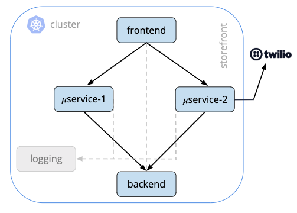

Storefront(그림 1)는 Kubernetes에서 실행되는 상당히 간단한 마이크로서비스 애플리케이션입니다. 여기에는 최종 사용자 요청을 처리하고 백엔드 서비스에 요청하는 두 개의 비즈니스 로직 서비스와 통신하는 프론트엔드 서비스가 있습니다. 이러한 모든 컨테이너는 로깅 서비스와 통신하고 비즈니스 논리 서비스 중 하나인 마이크로서비스 2는 이 애플리케이션에 대한 일부 전화 통신을 제공하기 위해 Twilio에 외부 요청을 보냅니다.

이러한 마이크로서비스를 실행하는 데 사용하는 상점 첫화면 네임스페이스에서 실행 중인 팟(Pod)을 빠르게 살펴보겠습니다.

```
kubectl get pods -n storefront

NAME                             READY   STATUS    RESTARTS   AGE
backend-6cfbdd589f-xxlkn         2/2     Running   0          22h
frontend-864f4fcdfd-2hhv4        4/4     Running   0          22h
logging-684747d7cd-bbjwx         1/1     Running   0          22h
microservice1-794cf77b9d-c27qr   4/4     Running   0          22h
microservice2-7bb79d9f4f-f7h6f   5/5     Running   0          22h
```

### 흐름 시각화 도우미 사용

다음으로 Calico Enterprise UI에 로그인하고 Flow Visualizer를 사용하여 이러한 서비스가 서로 통신하는 방식을 이해하겠습니다. Calico Enterprise에 로그인하고 왼쪽 탐색 메뉴에서 Flow Visualizations를 선택합니다.

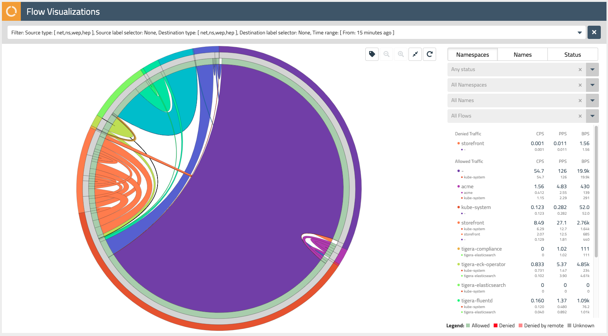

Flow Visualizer는 클러스터 내의 네트워크 트래픽에 대한 가시성을 확보하고 문제를 해결하는 강력한 도구입니다. 이 실습의 후반부에서는 이를 사용하여 매장 응용 프로그램에 대한 네트워크 정책을 권장합니다.

Flow Visualizer의 외부 링을 사용하여 클러스터 내에서 다양한 네임스페이스를 선택할 수 있습니다. 각 하위 섹션 위로 마우스를 가져가면 오른쪽의 드롭다운 필터에 네임스페이스 이름이 표시됩니다.

상점 전면 네임스페이스를 찾아 선택한 다음 오른쪽 상단에 있는 돋보기 버튼을 사용하여 이러한 네트워크 흐름을 확대합니다.

다음 내부 링(회색)의 하위 섹션 위로 마우스를 가져가면 상점 첫 화면 애플리케이션을 구성하는 각 마이크로서비스에 대한 포드 접두사가 표시됩니다. Calico Enterprise는 네트워크 흐름을 집계하므로 복제본 세트와 같은 Kubernetes 리소스가 지원하는 클러스터의 트래픽을 쉽게 이해할 수 있습니다.

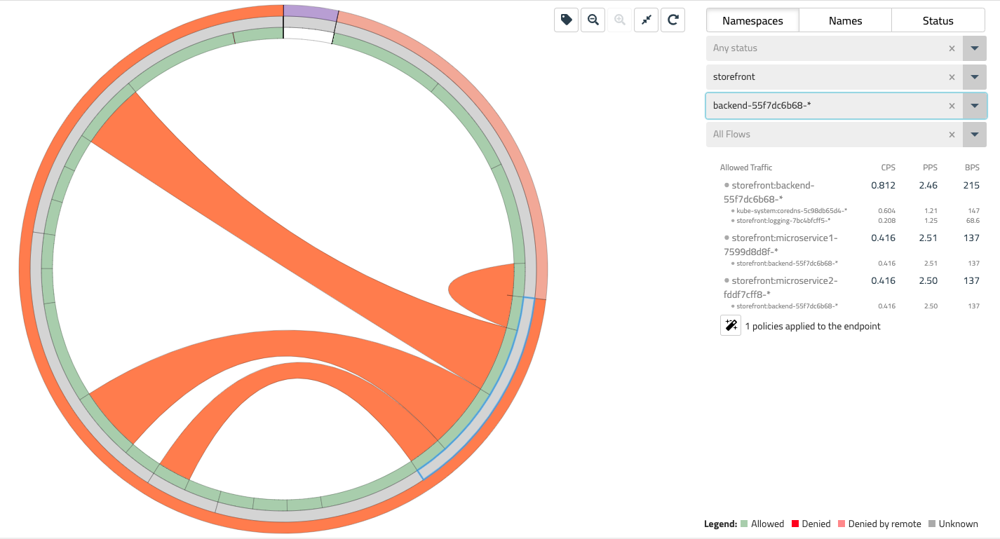

Flow Visualizer의 가장 안쪽 링을 사용하면 각 매장 마이크로서비스와 연결된 특정 네트워크 흐름을 선택할 수 있습니다. 각 하위 섹션 위로 마우스를 가져가면 오른쪽 드롭다운에 이러한 흐름이 각각 표시됩니다. 이 흐름은 이 실습의 시작 부분에 있는 다이어그램과 일치해야 합니다(그림 1).

### 정책 계층 이해

이제 스토어프론트 애플리케이션을 구성하는 마이크로서비스와 이들이 서로 통신하는 방식에 대해 더 잘 이해했으므로 플랫폼 엔지니어링 담당자의 역할을 가정하여 클러스터에 대한 네트워크 정책 정의를 시작하겠습니다.

Calico Enterprise를 사용하면 정책 계층을 사용하여 Kubernetes 플랫폼에 대한 "가드 레일"을 쉽게 정의할 수 있습니다. 정책 계층을 통해 플랫폼 엔지니어링 및 보안 팀은 매장과 같은 특정 애플리케이션에 대해 정의된 정책보다 우선하는 네트워크 정책을 시행할 수 있습니다.

Calico Enterprise UI에 로그인하고 왼쪽 탐색 메뉴에서 정책을 선택하십시오. 여기에서 클러스터 내에 정의된 모든 네트워크 정책과 정책 계층에 매핑하는 방법을 볼 수 있습니다.

그림 4- 계층에 따른 정책 평가

계층은 왼쪽에서 오른쪽으로 평가되고 계층 내의 네트워크 정책은 위에서 아래로 평가됩니다. 이는 사실상 보안 계층(그림 4)의 네트워크 정책이 트래픽을 평가하고 전달해야 그 아래 또는 오른쪽에 있는 정책이 동일한 트래픽을 볼 수 있음을 의미합니다. 계층은 RBAC에 연결되며 애플리케이션 팀을 포함하지 않고도 전체 클러스터에 대한 보안 및 플랫폼 제어를 구현하는 강력한 방법을 제공합니다. 랩 환경에는 몇 가지 일반적인 사용 사례의 몇 가지 예를 제공하는 플랫폼 및 보안 계층에 이미 몇 가지 정책이 있습니다.

### TWILIO API에 대한 액세스 활성화

플랫폼 엔지니어링 모자를 쓰고 정책 계층을 사용하여 클러스터에서 나가는 트래픽을 제어하는 ​​데 사용할 네트워크 정책을 정의해 보겠습니다. 이 경우 Twilio API에 액세스해야 하는 상점과 같은 애플리케이션입니다.

정책 게시판에서 플랫폼 계층의 +정책 추가 링크를 클릭합니다. 이 정책을 "twilio-integration"이라고 부르고 global.logging 뒤에 추가하고 정책의 범위를 전역으로 설정합니다.

기본적으로 GlobalNetworkPolicy는 전체 클러스터에 적용됩니다. 이 경우 특정 네임스페이스(즉, 다른 애플리케이션)가 Twilio API에 액세스할 수 있도록 하려고 합니다. 키가 "twilio"이고 값이 "allowed"인 네임스페이스 선택기를 추가합니다. 이 정책은 이 레이블로 Twilio에 액세스할 수 있는 권한이 부여된 네임스페이스에만 적용됩니다. 상점 전면 네임스페이스에는 이미 이 레이블이 있습니다.

유형에서 송신 규칙 확인란을 선택하고 수신 확인란을 선택 취소합니다. 이제 Twilio API 엔드포인트에 대한 트래픽을 화이트리스트에 추가하는 Allow egress 규칙을 추가해 보겠습니다. 여기에서 와일드카드 일치와 함께 DNS 규칙을 활용하여 엔드포인트의 하위 도메인이 변경되는 경우 애플리케이션이 중단되지 않도록 할 수 있습니다.

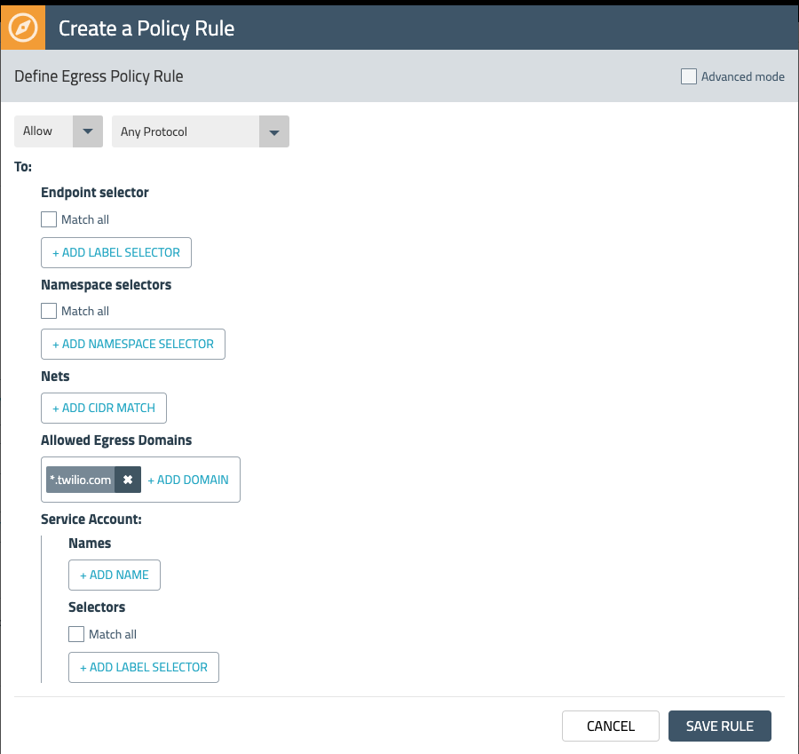

이 송신 규칙은 \*.twilio.com에 대한 트래픽을 허용하지만 클러스터를 떠나는 다른 모든 송신 트래픽도 제한하려고 합니다. 네트워크 세트를 사용하는 또 다른 송신 거부 규칙을 추가하여 이를 수행할 수 있습니다.

네트워크 세트를 사용하면 CIDR, IP 또는 도메인의 긴 목록을 만들고 네트워크 정책에서 참조할 수 있는 레이블로 추상화할 수 있습니다. 랩 설정에는 모든 공용 IP CIDR에 대한 기존 네트워크 세트가 있습니다. 아래 그림 6과 같이 "type=public" 레이블을 사용하여 Egress Deny 규칙에 추가합니다.

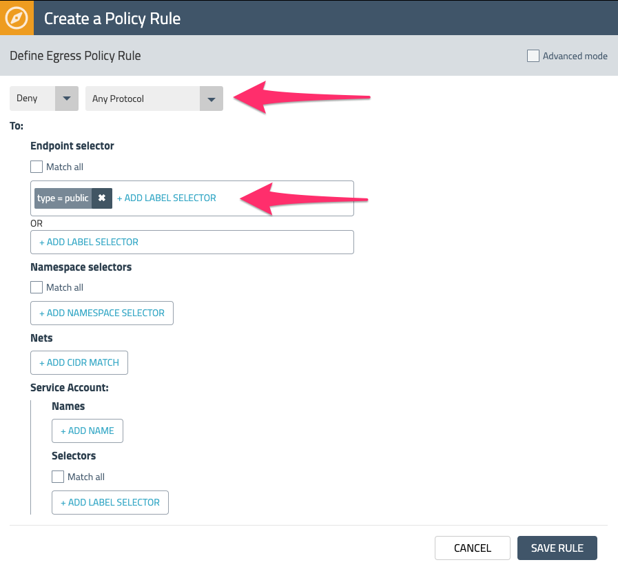

Enforce를 선택하여 정책을 저장하고 배포합니다. 왼쪽 탐색 메뉴에서 네트워크 세트를 선택하여 랩 환경에서 사용할 수 있는 다른 네트워크 세트를 확인하십시오.

### 상점 첫화면에 대한 정책 생성

이제 k8s 플랫폼에 대한 외부 액세스를 활성화하는 정책을 정의했으므로 애플리케이션 개발자 모자를 쓰고 매장 애플리케이션에 필요한 것만 화이트리스트에 추가하는 정책 정의를 시작하겠습니다. 즉, 네트워크에 대한 제로 트러스트 및 최소 권한 접근 방식 보안.

애플리케이션 개발자는 종종 Kubernetes에 익숙하지만 자체 k8 또는 Calico 네트워크 정책을 정의할 도메인 전문 지식이 없을 수 있습니다. 정책 권장 사항은 레이블 및 관련 네트워크 흐름을 기반으로 특정 워크로드에 대한 정책을 자동으로 생성하여 이 프로세스를 보다 쉽게 ​​만드는 Calico Enterprise의 핵심 기능입니다.

Flow Visualizer로 돌아가서 상점 전면 네임스페이스를 선택하고 이 보기를 확대합니다. 포드 접두사 위로 마우스를 가져갈 때 오른쪽에 있는 "요술 지팡이" 아이콘을 확인하십시오. 이는 정책 권장 사항을 생성하는 데 사용할 수 있습니다.

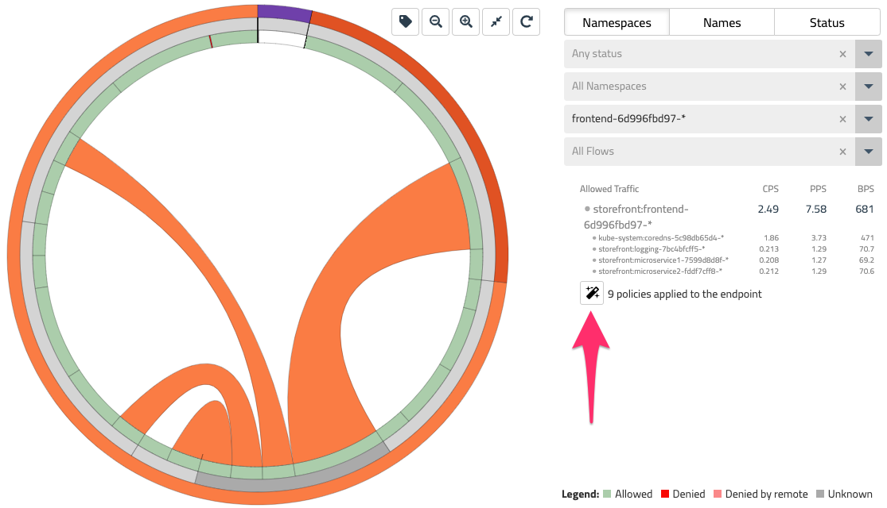

frontend-\* 포드 접두사를 선택하고 마술봉을 클릭하여 이 워크로드에 대한 네트워크 정책을 생성합니다. 그러면 프론트엔드에 대한 레이블 및 네트워크 흐름을 확인하여 권장되는 단계적 네트워크 정책으로 이동합니다.

다음 섹션에서 단계별 네트워크 정책을 다루겠지만 지금은 프론트엔드 정책으로 STAGE를 선택하고 microservice1, microservice2 및 백엔드에 대해 이 프로세스를 반복합니다.

### 정책 변경 사항 미리보기 및 준비

마지막 섹션에서는 정책 권장 사항을 사용하여 상점 첫 화면 응용 프로그램에 대한 네트워크 정책을 생성했습니다. 이 프로세스의 결과는 단계적 네트워크 정책 세트였습니다. 단계적 정책은 프로덕션으로 이동하기 전에 네트워크 정책의 영향을 평가할 수 있는 Calico Enterprise 리소스입니다. 특히 올바른 흐름이 허용되거나 거부되는지 확인할 수 있습니다. 방금 생성한 상점 정책에 대해 이 작업을 수행해 보겠습니다.

상점 첫화면에 대한 몇 가지 단계적 정책이 있는지 확인합니다.

```
kubectl get stagednetworkpolicies.projectcalico.org -n storefront

NAME                              CREATED AT
default.backend-55f7dc6b68        2020-01-10T01:08:09Z
default.frontend-6d996fbd97       2020-01-10T01:05:46Z
default.microservice1-7599d8d8f   2020-01-10T01:09:25Z
default.microservice2-fddf7cff8   2020-01-10T01:10:11Z
```

참고: Calico Enterprise UI를 많이 사용하고 있지만 Calico Enterprise의 대부분의 기능은 API/명령줄을 통해 사용할 수 있으므로 이러한 워크플로를 CI/CD 파이프라인에 쉽게 통합할 수 있습니다.

정책 게시판으로 돌아가 보겠습니다. 마지막 kubectl 명령에 나열된 단계적 정책 세트를 볼 수 있어야 합니다. 최상위 필터에는 이러한 정책을 숨기거나 표시하는 토글이 있습니다.

정책 게시판의 오른쪽 상단에서 "통계 전환" 메뉴를 찾아 모든 확인란을 선택합니다. 이제 준비한 항목을 포함하여 계층 및 정책 전반에 걸쳐 트래픽이 어떻게 흐르는지 조감도를 볼 수 있습니다. 통계는 이러한 단계적 정책이 시행되는 경우 트래픽이 허용될 것임을 보여줍니다. Flow Visualizer와 함께 Policies Board는 클러스터 내의 트래픽을 신속하게 파악할 수 있는 또 다른 유용한 도구입니다.

### 정책 영향 미리보기

마무리하기 전에 Calico Enterprise 도구 상자의 다른 도구인 정책 영향 미리 보기를 살펴보겠습니다. 단계적 정책을 사용하면 더 오랜 기간 동안 네트워크 정책을 평가할 수 있지만 정책 영향 미리보기는 과거 트래픽 흐름을 사용하여 기존 정책에 대한 변경 사항에 대한 빠른 온전성 검사를 제공합니다.

기본 계층으로 돌아가서 방금 storefront.default.backend 접두사를 사용하여 생성한 준비된 정책을 열고 편집을 선택합니다. 우리는 무모한 일을 하고 이그레스 규칙을 삭제할 것입니다. 이제 오른쪽 상단에서 미리보기를 선택합니다.

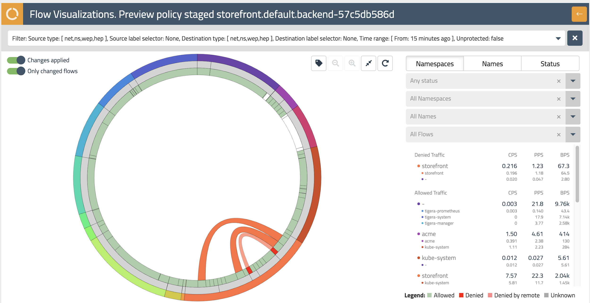

안녕하세요, Flow Visualizer입니다! 이번에는 흐름 시각화 도우미가 방금 만든 정책 변경으로 영향을 받는 흐름을 강조 표시합니다. 이는 빨간색으로 깜박이는 흐름으로 표시됩니다. 이 흐름 위로 마우스를 가져가면 오른쪽에 세부정보가 표시됩니다.

오른쪽 상단의 뒤로 화살표를 누르면 이 편집을 취소할 수 있는 storefront.default.backend 정책으로 돌아갑니다.

### 마무리

플랫폼 엔지니어링 담당자로서 애플리케이션 팀을 위한 가드레일 및 외부 액세스를 유지하기 위한 정책 계층의 기본 사항을 더 잘 이해해야 합니다. 그리고 개발자로서 귀하는 Calico Enterprise가 귀하의 애플리케이션에 특정한 정책 권장 사항을 사용하여 동서 트래픽의 마이크로 세분화를 구현하기 위한 노력을 시작하는 데 어떻게 도움이 되는지 배웠습니다. 그 과정에서 Calico Enterprise가 제공하는 몇 가지 가시성 및 분석에 대해서도 다루었습니다.

실험실 설정에서 자유롭게 Calico Enterprise를 탐색하십시오.

## 가시성 및 문제 해결

## 시작하기

계속 진행하기 전에 터미널에 lab2 set\_up을 입력하여 이 실습의 환경을 설정하는 것을 잊지 마십시오.

## 소개

이 실습에서는 Calico Enterprise를 사용하여 플랫폼 엔지니어링 및 개발 팀이 클러스터 내 네트워킹 관점에서 발생하는 모든 것에 대한 가시성을 얻고 문제를 신속하게 진단하며 정책이 실시간으로 평가되는 방식을 쉽게 이해하는 방법을 배웁니다. . Calico Enterprise가 제공하는 가시성은 컨테이너 플랫폼의 운영을 개선하고 네트워크 보안 모범 사례를 채택하는 초석입니다.

### 다음을 배우게 됩니다.

* Flow Visualizer를 사용하여 클러스터 내의 기존 트래픽 흐름에 대한 가시성을 확보하고 거부된 트래픽의 소스를 빠르게 식별하는 방법
* 정책 위원회 및 정책 편집기를 사용하여 정책 계층에서 정책이 실시간으로 평가되는 방식을 이해하는 방법
* 네트워크 흐름 로그를 사용하여 클러스터의 "내부"를 살펴보고 워크로드가 문제를 해결하고 진단하기 위해 모든 Kubernetes 컨텍스트와 통신하는 방법에 대한 자세한 보기를 얻는 방법

### 설정

이 실습에서는 매장 전면이라고 하는 매우 간단한 마이크로서비스 애플리케이션을 사용하여 Calico Enterprise의 가시성 및 문제 해결 기능을 이해합니다. 다른 실습의 매장 전면에 이미 익숙한 경우 다음 섹션으로 건너뛸 수 있습니다.


Storefront(그림 1)는 Kubernetes에서 실행되는 상당히 간단한 마이크로서비스 애플리케이션입니다. 여기에는 최종 사용자 요청을 처리하고 백엔드 서비스에 요청하는 두 개의 비즈니스 로직 서비스와 통신하는 프론트엔드 서비스가 있습니다. 이러한 모든 컨테이너는 로깅 서비스와 통신하고 비즈니스 논리 서비스 중 하나인 마이크로서비스 2는 이 애플리케이션에 대한 일부 전화 통신을 제공하기 위해 Twilio에 외부 요청을 보냅니다.

이러한 마이크로서비스를 실행하는 데 사용하는 상점 첫화면 네임스페이스에서 실행 중인 팟(Pod)을 빠르게 살펴보겠습니다.

```
kubectl get pods -n storefront 

NAME                             READY   STATUS    RESTARTS   AGE
backend-6cfbdd589f-xxlkn         2/2     Running   0          22h
frontend-864f4fcdfd-2hhv4        4/4     Running   0          22h
logging-684747d7cd-bbjwx         1/1     Running   0          22h
microservice1-794cf77b9d-c27qr   4/4     Running   0          22h
microservice2-7bb79d9f4f-f7h6f   5/5     Running   0          22h
```

### 흐름 시각화 도우미 사용

다음으로 Calico Enterprise UI에 로그인하고 Flow Visualizer를 사용하여 이러한 서비스가 서로 통신하는 방식을 이해하겠습니다. Calico Enterprise에 로그인하고 왼쪽 탐색 메뉴에서 Flow Visualizer를 선택합니다.


Flow Visualizer는 클러스터 내의 네트워크 트래픽에 대한 가시성을 확보하고 문제를 해결하는 강력한 도구입니다. 원으로 표시되는 클러스터 끝점 간의 트래픽 흐름을 이해하기 위해 Flow Visualizer가 제공하는 여러 가지 보기를 살펴보겠습니다. 교통 흐름은 이 원 내에서 호로 표시되고 각 호의 두께는 해당 흐름에 대한 교통량을 나타냅니다.

### 네임스페이스 보기

Flow Visualizer의 기본 보기는 네임스페이스 보기입니다. 이 보기에서 Flow Visualizer의 다른 색상은 다른 네임스페이스의 트래픽을 나타냅니다. Flow Visualizer의 외부 링을 사용하여 클러스터 내에서 다양한 네임스페이스를 선택할 수 있습니다. 각 하위 섹션 위로 마우스를 가져가면 오른쪽의 드롭다운 필터에 네임스페이스 이름이 표시됩니다.

외부 링에서 상점 전면 네임스페이스를 찾아 선택한 다음 오른쪽 상단에 있는 돋보기 버튼을 사용하여 이러한 네트워크 흐름을 확대합니다. 다음 내부 링(회색)의 하위 섹션 위로 마우스를 가져가면 상점 첫 화면 애플리케이션을 구성하는 각 마이크로서비스에 대한 포드 접두사가 표시됩니다. Calico Enterprise는 네트워크 흐름을 집계하므로 복제본 세트와 같은 Kubernetes 리소스가 지원하는 클러스터의 트래픽을 쉽게 이해할 수 있습니다.


Flow Visualizer의 가장 안쪽 링을 사용하면 각 매장 마이크로서비스와 연결된 특정 네트워크 흐름을 선택할 수 있습니다. 각 하위 섹션 위로 마우스를 가져가면 오른쪽 드롭다운에 이러한 흐름이 각각 표시됩니다. 이 흐름은 이 실습의 시작 부분에 있는 다이어그램과 일치해야 합니다(그림 1).

### 이름 보기

이름 보기는 Flow Visualizer 내의 각 색상이 클러스터 내의 다른 포드 접두사 이름을 나타내는 것을 제외하고는 네임스페이스 보기와 거의 동일합니다. 네임스페이스 및 기타 필터와 함께 사용되는 이 보기는 특정 애플리케이션 내의 문제를 진단하는 데 도움이 될 수 있습니다.

### 상태 보기

상태 보기는 허용된 트래픽의 경우 녹색과 거부된 트래픽의 경우 빨간색의 두 가지 색상으로만 흐름을 표시한다는 점에서 Flow Visualizer의 다른 보기와 다릅니다. 상태 보기는 개발, 테스트 또는 프로덕션 클러스터에서 예상치 못한 거부된 트래픽의 소스를 빠르게 식별하는 가장 좋은 방법입니다.

간단한 예를 통해 이 보기를 실제로 살펴보겠습니다. 클러스터에 새 포드를 배포할 lab2 deploy\_rogue 명령을 실행합니다. 이 포드는 CI/CD 파이프라인에서 잘못된 구성이나 잘못된 문제 또는 손상을 나타낼 수 있는 문제와 같이 환경 내의 여러 문제를 나타낼 수 있습니다.

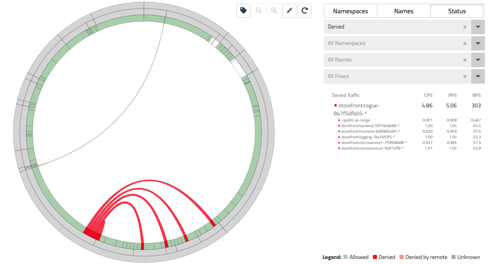

상태 보기의 흐름 시각화 도우미로 돌아가면 불량 포드가 상점 첫 화면 애플리케이션 내의 다양한 끝점에 도달하기 시작하면서 빨간색 흐름으로 표시된 일부 거부된 트래픽이 표시되기 시작해야 합니다.

* 오른쪽 필터를 사용하여 이러한 흐름만 보려면 상태 = 거부됨을 선택한 다음 중간 링 위로 마우스를 이동하여 이러한 각 흐름과 관련된 특정 끝점으로 이동합니다.

### 필터링

Flow Visualizer는 유용한 필터링 기능과 함께 사용할 수 있습니다. 마지막 섹션에서 사용한 일부 드롭다운 필터 외에도 상단 필터 표시줄에 추가 필터링 기능이 있습니다.

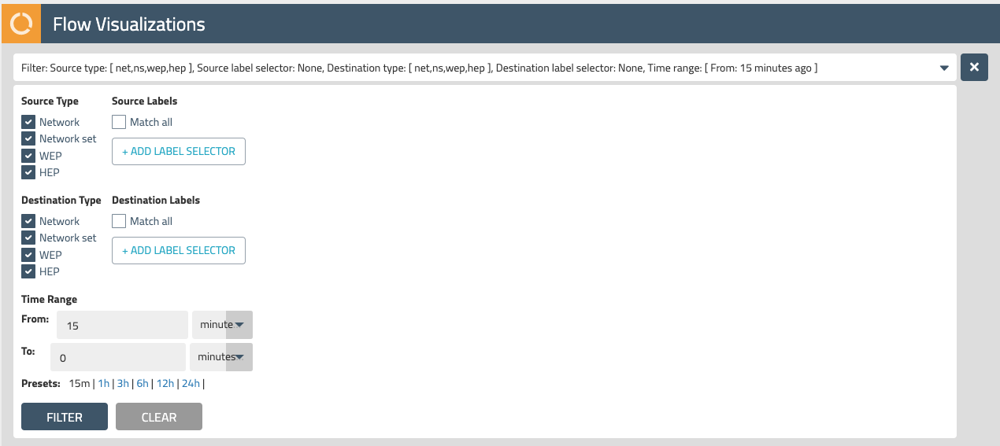

상단 필터 표시줄을 탐색하고 시간 범위, 소스 및 대상 레이블, 다양한 끝점 유형에 대한 다양한 필터의 효과를 이해합니다.

엔드포인트 유형에는 다음이 포함됩니다.

* 네트워크 - 공용 및 사설 IP 주소
* 네트워크 세트 - 레이블이 있는 IP, 도메인, CIDR 범위 등의 긴 목록을 추상화할 수 있는 Calico 리소스(Calico 네트워크 정책에서도 사용할 수 있음)
* HEP - 호스트 네트워킹을 사용하는 호스트 끝점
* WEP - 워크로드 엔드포인트 가상 네트워킹을 사용하는 VM 및 포드

### 정책 위원회 사용

이제 스토어프론트 애플리케이션을 구성하는 마이크로서비스와 이들이 서로 통신하는 방식에 대해 더 잘 이해했으므로 이러한 네트워크 흐름에서 정책이 평가되는 방식을 이해하는 데 유용한 방법을 제공할 수 있는 또 다른 도구를 살펴보겠습니다. 정책위원회.

### 정책 계층

Calico Enterprise를 사용하면 정책 계층을 사용하여 Kubernetes 플랫폼에 대한 "가드 레일"을 쉽게 정의할 수 있습니다. 정책 계층을 통해 플랫폼 엔지니어링 및 보안 팀은 매장과 같은 특정 애플리케이션에 대해 정의된 정책보다 우선하는 네트워크 정책을 시행할 수 있습니다.

Calico Enterprise UI로 돌아가서 왼쪽 탐색 메뉴에서 정책을 선택하십시오. 여기에서 클러스터 내에 정의된 모든 네트워크 정책과 정책 계층에 매핑하는 방법을 볼 수 있습니다.

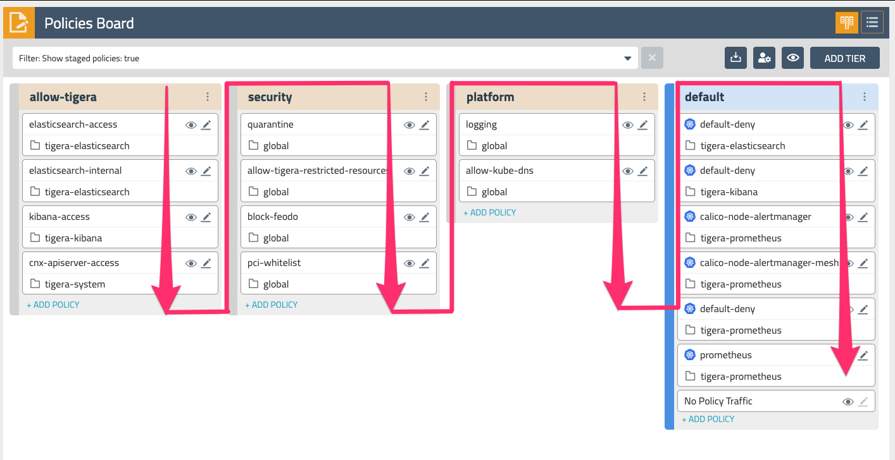

계층은 왼쪽에서 오른쪽으로 평가되고 계층 내의 네트워크 정책은 위에서 아래로 평가됩니다. 이는 사실상 보안 계층(그림 4)의 네트워크 정책이 트래픽을 평가하고 전달해야 그 아래 또는 오른쪽에 있는 정책이 동일한 트래픽을 볼 수 있음을 의미합니다. 계층은 RBAC에 연결되며 애플리케이션 팀을 포함하지 않고도 전체 클러스터에 대한 보안 및 플랫폼 제어를 구현하는 강력한 방법을 제공합니다. 랩 환경에는 몇 가지 일반적인 사용 사례의 몇 가지 예를 제공하는 플랫폼 및 보안 계층에 이미 몇 가지 정책이 있습니다.

### 측정항목 활성화

정책 위원회에서 몇 가지 추가 메트릭을 활성화하여 이러한 정책이 평가되는 방식에 대한 가시성을 확보하겠습니다. 오른쪽 상단 모서리에서 "눈" 아이콘을 클릭하고 "모두 표시"를 선택하여 정책 게시판에 모든 메트릭을 표시합니다.

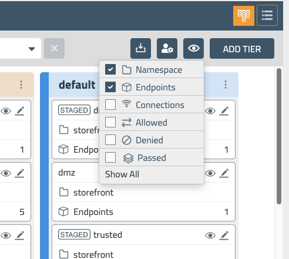

이제 정책 게시판의 각 정책에 대한 추가 메트릭 세트(연결, 허용됨, 거부됨 및 통과됨)가 표시되어야 합니다. 전달된 트래픽은 계층 끝에 있는 정책에서 발생하며 다음 계층으로 전달되는 트래픽의 양을 보여줍니다.

또한 이 실습의 앞부분에서 배포한 불량 포드에서 오는 일부 거부된 트래픽이 표시되어야 합니다. 상점 첫화면 애플리케이션의 워크로드에 대해 구역 기반 아키텍처(dmz, trusted 및 limited)를 구현하는 기본 계층의 일부 네트워크 정책이 있습니다. 다음 섹션에서는 이러한 정책 내의 규칙이 네트워크 트래픽을 평가하는 방법을 자세히 살펴보겠습니다.

### 정책 보기 측정항목

default.trusted보기/눈 아이콘을 선택하여 정책 에서 거부된 트래픽을 자세히 살펴보겠습니다 . 단일 정책을 보면 Calico Enterprise가 규칙별로 제공하는 세부 가시성 수준을 알 수 있습니다. 이 정책은 dmz에서 들어오는 트래픽을 허용하고 신뢰할 수 있는 영역 내의 워크로드가 서로 통신하도록 허용하며 제한된 영역으로 나가는 트래픽을 허용합니다.

정책 규칙과 함께 표시되는 메트릭을 통해 네트워크 정책 및 거부된 트래픽 문제를 쉽게 진단할 수 있습니다. 이 경우 우리가 배포한 불량 포드가 dmz 또는 신뢰할 수 있는 영역의 일부가 아니기 때문에 거부된 트래픽이 이 정책의 수신 규칙에 있음을 알 수 있습니다.

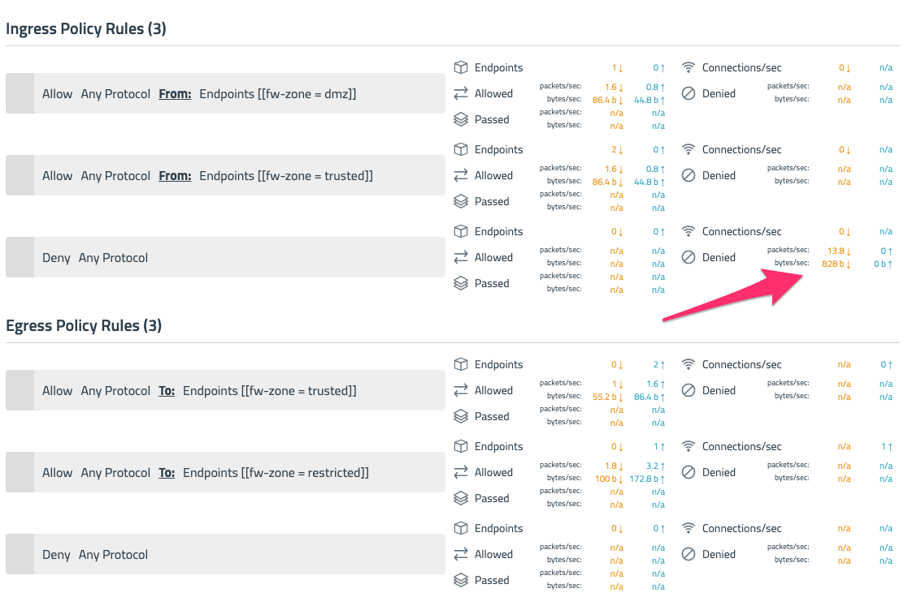

### 흐름 로그 사용

Policy Board 및 Flow Visualizer는 클러스터 내의 트래픽 흐름을 이해하는 강력한 방법을 제공하지만 네트워크 연결 문제를 해결하기 위해 더 높은 수준의 세부 정보에 액세스해야 하는 상황이 있을 수 있습니다. Calico Enterprise가 생성할 수 있는 일부 원시 흐름 로그 데이터를 "내부"에서 살펴보겠습니다.

* Calico Enterprise UI의 왼쪽 탐색 메뉴에서 Kibana를 선택하고 랩 설정의 일부로 제공된 Kibana 사용자 자격 증명을 사용하여 로그인합니다. Calico Enterprise에는 Flow Visualizer, 대시보드 및 정책 보드의 메트릭, 정책 자동화 및 테스트 기능, 규정 준수 및 보안과 같은 여러 주요 기능을 구동하는 플로우 로그 데이터를 수집하는 Elastic의 완전히 통합된 배포가 포함되어 있습니다.

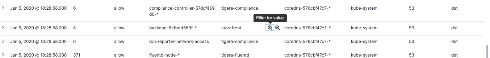

* 왼쪽 탐색 메뉴에서 대시보드를 선택한 다음 아래로 스크롤하여 Calico Enterprise에서 생성한 플로우 로그 데이터의 테이블 보기를 보십시오. Kibana는 이 데이터를 신속하게 드릴할 수 있는 강력한 필터링 기능을 자체적으로 제공합니다. source\_namespace열 위에 마우스를 놓고 상점 첫화면 행 중 하나 옆에 있는 '값 필터링' 아이콘을 선택하십시오. 에 대해 동일한 선택을 반복합니다 dest\_namespace.

이제 상점 첫 화면 애플리케이션 내에서 흐름 로그 데이터를 살펴보고 있습니다. 맨 왼쪽에 있는 캐럿/화살표를 사용하여 이 행 중 하나를 확장합니다.

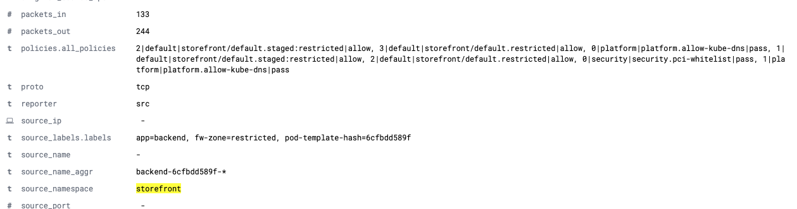

시간을 내어 단일 흐름 로그 항목에 제공된 모든 필드를 검토하십시오. 각 항목에는 30개 이상의 서로 다른 필드가 있지만 문제 해결과 관련하여 가장 유용한 필드는 다음과 같습니다.

* source\_name\_aggr와 dest\_name\_aggr, 워크로드 사이의 집계 흐름에 대한 포드의 접두사를 제공하는 복제 세트로 백업 할 수 있습니다 엔드 포인트 메이크업 감각에 쉽게 그것을 만들기
* policies.all\_policies 이 흐름에 적용된 계층 순서|계층|정책과 평가 결과(허용, 거부 또는 통과)를 보여줍니다.
* source\_labels.labels그리고 dest\_labels.labels각각의 소스 및 대상 엔드 포인트에 적용는 Kubernetes 레이블을 나열

모든 Kubernetes 컨텍스트가 포함된 이러한 원시 흐름 로그는 클러스터에 대한 가시성을 확보하고 네트워크 트래픽을 신속하게 파악하여 문제를 해결하고 진단하는 또 다른 유용한 도구를 제공합니다.

### 마무리

Kubernetes 플랫폼을 운영하기 위한 가장 기본적인 구성 요소 중 하나는 클러스터에 대한 가시성을 확보하고 워크로드가 서로 통신하는 방식을 이해할 수 있는 도구가 있다는 것입니다. 이 실습에서는 Calico Enterprise의 기능을 사용하여 Flow Visualizer로 네트워크 트래픽을 시각화하고, Policy Board 및 정책 편집기의 메트릭으로 정책 평가를 이해하고, "underly"를 살펴보고 얼마나 많은 Kubernetes 컨텍스트가 흐름 로그에 보존 - 문제를 보다 신속하게 해결하고 진단하는 데 도움이 됩니다.

실험실 설정에서 자유롭게 Calico Enterprise를 탐색하십시오.

## KUBERNETES에서 기존 보안 제어 구현

## 시작하기

계속 진행하기 전에 lab3 set\_up터미널을 입력 하여 이 실습의 환경을 설정 하는 것을 잊지 마십시오 .

## 소개

이 실습에서는 Calico Enterprise를 사용하여 보안 및 규정 준수 팀이 기존 엔터프라이즈 제어를 Kubernetes로 쉽게 확장하는 방법을 배웁니다. 클러스터 내 워크로드의 동적 특성은 보안 및 규정 준수 실무자에게 여러 가지 문제를 제시합니다. Calico Enterprise는 Kubernetes 자체를 확장하고 클러스터 내의 선언적 메타데이터를 이해하는 도구 세트를 사용하여 이러한 문제를 해결합니다.

다음을 배우게 됩니다.

* 영역 기반 제어 및 보안 요구 사항을 적용하기 위해 선언적 및 레이블 기반 Calico 네트워크 정책을 사용하는 방법
* 애플리케이션 및 개발 팀이 우회할 수 없는 더 높은 우선 순위의 보안 및 규정 준수 정책을 시행하는 방법으로 정책 계층을 사용하는 방법
* Kubernetes 구성을 활용하고 CI/CD 파이프라인과 잠금 단계에서 지속적으로 실행할 수 있는 규정 준수 보고서를 정의하는 방법
* 감사 로그를 사용하여 자식 친화적인 diff로 네트워크 정책 변경 사항을 모니터링하고 경고하는 방법

### 설정

이 실습에서는 storefront라는 상당히 간단한 마이크로서비스 애플리케이션을 사용하여 Calico Enterprise의 가시성 및 문제 해결 기능을 이해합니다.


Storefront(그림 1)는 Kubernetes에서 실행되는 상당히 간단한 마이크로서비스 애플리케이션입니다. 여기에는 최종 사용자 요청을 처리하고 백엔드 서비스에 요청하는 두 개의 비즈니스 로직 서비스와 통신하는 프론트엔드 서비스가 있습니다. 이러한 모든 컨테이너는 로깅 서비스와 통신하고 비즈니스 논리 서비스 중 하나인 마이크로서비스 2는 이 애플리케이션에 대한 일부 전화 통신을 제공하기 위해 Twilio에 외부 요청을 보냅니다.

* 스토어프론트 네임스페이스에서 실행되는 포드(및 해당 레이블)를 빠르게 살펴보겠습니다.

```
kubectl get pods -n storefront --show-labels

NAME                            LABELS
backend-55f7dc6b68-8n9cc       app=backend,fw-zone=restricted,pod-template-hash=55f7dc6b68
frontend-6d996fbd97-9g92v  app=frontend,fw-zone=dmz,pod-template-hash=6d996fbd97
logging-7bc4bfcff5-5x49j          app=logging,pod-template-hash=7bc4bfcff5
microservice1-7599d8d8f-4mc98   app=microservice1,fw-zone=trusted,pod-template-hash=7599d8d8f
microservice2-fddf7cff8-fggd2  app=microservice2,fw-zone=trusted,pod-template-hash=fddf7cff8
```

상점 첫 화면 애플리케이션을 구성하는 팟(Pod)에 기존 레이블이 몇 개 있음을 주목하십시오. 이 실습의 뒷부분에서 이러한 레이블을 사용하여 Calico Enterprise에서 네트워크 정책을 구현합니다. 그러나 그 전에 Calico Enterprise에서 정책 계층이 작동하는 방식을 빠르게 이해해야 합니다.

### 정책 위원회 사용

정책 위원회는 클러스터의 네트워크 흐름에서 정책 계층 전반에 걸쳐 정책이 평가되는 방식을 이해하는 데 유용한 방법을 제공할 수 있습니다.

* Calico Enterprise UI에 로그인하고 왼쪽 탐색 메뉴에서 정책을 선택하십시오. 여기에서 클러스터 내에 정의된 모든 네트워크 정책과 정책 계층에 매핑하는 방법이 포함된 정책 보드를 볼 수 있습니다.

### 정책 계층

Calico Enterprise를 사용하면 정책 계층을 사용하여 Kubernetes 플랫폼에 대한 "가드 레일"을 쉽게 정의할 수 있습니다. 정책 계층을 통해 플랫폼 엔지니어링 및 보안 팀은 매장과 같은 특정 애플리케이션에 대해 정의된 정책보다 우선하는 네트워크 정책을 시행할 수 있습니다.


계층은 왼쪽에서 오른쪽으로 평가되고 계층 내의 네트워크 정책은 위에서 아래로 평가됩니다. 이는 사실상 보안 계층(그림 2)의 네트워크 정책이 트래픽을 평가하고 전달해야 그 아래 또는 오른쪽에 있는 정책이 동일한 트래픽을 볼 수 있음을 의미합니다. 계층은 RBAC에 연결되며 애플리케이션 팀을 포함하지 않고도 전체 클러스터에 대한 보안 및 플랫폼 제어를 구현하는 강력한 방법을 제공합니다. 랩 환경에는 몇 가지 일반적인 사용 사례의 몇 가지 예를 제공 하는 몇 가지 정책 platform과 security계층이 이미 있습니다 . 애플리케이션에 특정한 정책은 일반적으로 default계층에 포함됩니다.

다음 섹션에서는 default상점 첫 화면 애플리케이션 에 대한 계층 에서 정책을 구현하기 시작 합니다.

### 영역 기반 네트워크 정책 구현

기존 방화벽에서 가장 널리 채택된 배포 모델 중 하나는 영역 기반 아키텍처를 사용하는 것입니다. 여기에는 애플리케이션의 프론트엔드를 DMZ에, 비즈니스 로직 서비스를 신뢰할 수 있는 영역에, 백엔드 데이터 저장소를 Restricted에 넣는 작업이 포함되며, 모두 영역이 서로 통신하는 방법을 제어합니다. 스토어프론트 애플리케이션의 경우 다음과 같이 표시됩니다.

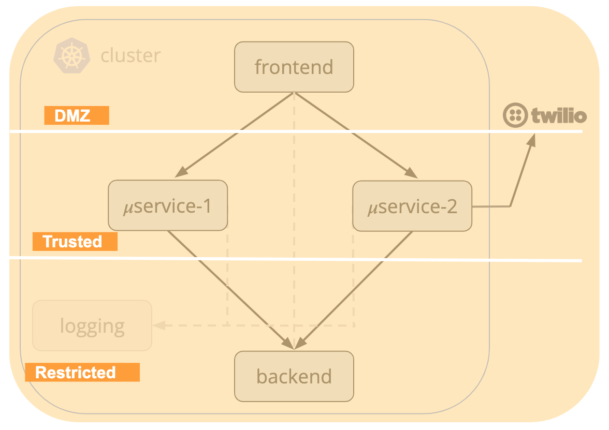

포드에 이미 있는 레이블을 사용하여 DMZ 영역에 대한 네트워크 정책을 만드는 것으로 시작하겠습니다. 왼쪽 탐색 메뉴에서 정책을 선택합니다. 그런 다음 기본 계층 하단에서 +정책 추가를 선택합니다.

### 비무장지대

* 다음 속성을 사용하여 DMZ 정책을 만듭니다.
  * 정책 이름을 dmz로 지정하고 앞에 삽입하십시오. tigera-compliance.default-deny
  * 범위 를 Namespace = storefront 로 설정하십시오.
  * fw-zone=dmz(가)에서 적용 대상 섹션에 대한 레이블 선택기를 추가
  * 아래 유형 수신 및 송신을 모두 선택
* 다음 인그레스 규칙을 추가합니다.
  * 허용 - 모든 프로토콜 - 보낸 사람: 끝점 선택기 type=public
  * 거부 - 모든 프로토콜
* 다음 이그레스 규칙을 추가합니다.
  * 허용 - 모든 프로토콜 - 대상: 끝점 선택기 fw-zone=trusted또는app=logging
  * 거부 - 모든 프로토콜
  * 시행을 선택하여 정책 저장

storefront.dmz방금 생성 한 정책은 기본 계층의 맨 위에 있어야 합니다. 어떤 이유로 그렇지 않은 경우 정책을 맨 위로 끌어 계층 내에서 순서를 변경할 수 있습니다.

### 신뢰할 수 있는 영역

* 이제 +ADD POLICY를 다시 추가하고 다음 속성을 사용하여 신뢰할 수 있는 정책을 생성해 보겠습니다.
  * 신뢰할 수 있는 정책의 이름을 지정하고 다음에 추가하도록 선택 storefront.dmz
  * 범위 를 Namespace = storefront 로 설정하십시오.
  * (가)에서 적용 대상 섹션에 대한 레이블 선택기를 추가fw-zone=trusted
  * 유형에서 Ingress와 Egress를 모두 선택합니다.
  * 다음 인그레스 규칙을 추가합니다.
    * 허용 - 모든 프로토콜 - 보낸 사람: 끝점 선택기 fw-zone=dmz또는fw-zone=trusted
    * 거부 - 모든 프로토콜
  * 다음 이그레스 규칙을 추가합니다.
    * 허용 - 모든 프로토콜 - 대상: 끝점 선택기 fw-zone=restricted
    * 거부 - 모든 프로토콜
* 시행을 선택하여 정책 저장

### 제한 구역

* 마지막으로 다음 속성을 사용하여 제한된 정책을 생성해 보겠습니다.
  * 정책의 이름을 제한하고 다음에 추가하도록 선택합니다. storefront.trusted
  * 범위 를 Namespace = storefront 로 설정하십시오.
  * (가)에서 적용 대상 섹션에 대한 레이블 선택기를 추가fw-zone=restricted
  * 아래 유형 수신 및 송신을 모두 선택
  * 다음 인그레스 규칙을 추가합니다.
    * 허용 - 모든 프로토콜 - 보낸 사람: 끝점 선택기 fw-zone=trusted또는fw-zone=restricted
    * 거부 - 모든 프로토콜
  * 다음 이그레스 규칙을 추가합니다.
    * 허용 - 모든 프로토콜
* 시행을 선택하여 정책 저장

방금 만든 세 가지 정책은 워크로드가 이러한 각 영역 내에서 통신하는 방법을 제어하는 ​​제어를 구현합니다. 상점 첫 화면에 새로운 마이크로서비스를 추가함에 따라 이러한 영역 중 하나에 배치하는 것은 포드에 적절한 레이블을 할당하는 것만큼 간단합니다.

* 왼쪽 탐색 메뉴의 대시보드로 이동하여 작업을 확인하고 정책별 막대 그래프가 허용된 트래픽에 대해 녹색만 표시하고 거부된 트래픽에 대해 빨간색이 표시되지 않는지 확인합니다. 트래픽을 거부하는 정책이 있는 경우 해당 정책을 다시 방문하여 각 규칙에 대한 실시간 메트릭을 확인하여 거부된 트래픽의 소스를 확인합니다.

### 네트워크 세트

DMZ 정책에서는 type=publicIngress 규칙 의 레이블 을 사용했습니다 . 이 레이블은 Network Set 이라는 Calico 리소스를 참조합니다 . 네트워크 세트를 사용하면 CIDR, IP 또는 도메인의 긴 목록을 만들고 네트워크 정책에서 참조할 수 있는 레이블로 추상화할 수 있습니다. 실습 설정에는 모든 공용 IP CIDR("유형=공용")에 대한 기존 네트워크 세트가 있습니다. 왼쪽 탐색 메뉴에서 추가 네트워크 세트를 자유롭게 탐색하십시오.

### 네트워크 정책 준수 시행

앞에서 언급했듯이 정책 계층 은 전체 Kubernetes 플랫폼에 대한 "가드 레일"을 정의하는 데 유용한 도구가 될 수 있습니다. 이를 통해 운영자는 애플리케이션 개발자의 작업을 방해하지 않고도 보안 및 규정 준수 제어를 정의할 수 있습니다. RBAC를 통해 계층을 제어할 수도 있다는 점을 감안할 때 개발자가 이러한 제어를 부주의하게 우회할 수 없도록 합니다. 이 섹션에서는 네트워크 정책에서 서비스 계정을 참조하는 정책 계층 및 Calico의 기능을 활용하여 상점 첫 화면 응용 프로그램 또는 실제로 클러스터의 모든 응용 프로그램에서 PCI 규정 준수에 대한 제어를 구현합니다.

### 서비스 계정

Calico 네트워크 정책은 끝점, 끝점의 네임스페이스 또는 끝점의 서비스 계정에 있는 레이블과 일치하는 선택기를 사용하여 끝점에 적용할 수 있습니다. 끝점의 서비스 계정을 기반으로 선택기를 적용하면 Kubernetes RBAC를 사용하여 서비스 계정에 레이블을 할당할 수 있는 사용자를 제어할 수 있습니다. 이를 통해 서비스 계정에 레이블을 할당할 수 있는 그룹과 팟(Pod)을 배포할 수 있는 그룹을 구분할 수 있습니다.

이 실습의 목적을 위해 서비스 계정으로 각 마이크로 서비스를 이미 설정했습니다. 지불 카드 데이터가 있는 워크로드에 액세스할 수 있는 권한이 있는 서비스 계정은 "PCI=true"로 레이블이 지정되었습니다.

포드가 PCI 레이블이 지정된 서비스 계정으로 설정한 규정 경계를 넘어 통신할 수 없도록 하는 네트워크 정책을 생성해 보겠습니다.

* 정책 게시판을 방문하여 보안 계층 ​​하단에서 +정책 추가를 선택하고 다음 세부 정보로 새 네트워크 정책을 생성합니다.
  * 정책 이름을 지정하고 pci-whitelist앞에 삽입global.pass
  * 정책 범위 는 글로벌이어야 합니다.
  * (가)에서 적용 섹션, PCI의 서비스 계정 라벨 선택이 참 = 사용
  * 에서 유형 섹션 확인 입구 및 출구가 모두 선택하기
  * 수신 규칙을 추가하고 오른쪽 상단의 '고급 모드' 확인란을 선택합니다.
    * 거부 - 모든 프로토콜 - 받는 사람: 서비스 계정 레이블 PCI=true, 보낸 사람: 서비스 계정 레이블 여기서 PCI!=true
  * 통과 - 모든 프로토콜 - 대상: 끝점 선택기 레이블이 있는 송신 규칙 추가 k8s-app=kube-dns
  * 통과 - 모든 프로토콜 - 대상: 끝점 선택기 레이블 유형=공개인 송신 규칙을 추가합니다.
  * 송신 규칙을 추가하고 오른쪽 상단의 '고급 모드' 확인란을 선택합니다.
    * 거부 - 모든 프로토콜 - To: PCI!=true인 서비스 계정 레이블, From: 서비스 계정 레이블 PCI=true
* 시행을 선택하여 정책 저장 이 정책은 PCI 레이블이 지정된 서비스 계정이 있는 팟(Pod)만 서로 통신할 수 있도록 합니다. PCI 레이블이 지정된 서비스 계정이 포함되지 않은 트래픽의 경우 Pass 작업을 사용하여 이 트래픽을 Calico 네트워크 정책의 다음 계층으로 "전달"합니다.

### 규정 준수 보고서

많은 조직이 직면한 과제 중 하나는 비즈니스를 운영하는 데 사용하는 인프라 전반에 걸쳐 규정 준수 상태를 보고할 수 있다는 것입니다. 이 문제는 Kubernetes의 동적이고 일시적인 특성으로 인해 더욱 복잡해집니다. 모든 차원에서 새로운 애플리케이션과 서비스가 생성, 삭제 및 확장되는 상황에서 조직은 규정 준수 상태에 대한 증명을 어떻게 제공할 수 있습니까?

이 섹션에서는 Calico Enterprise를 사용하여 CI/CD 파이프라인과 일치하는 규정 준수 상태를 평가할 수 있는 동적 규정 준수 보고서를 생성하는 방법에 대한 간단한 예를 살펴보겠습니다.

CIS 벤치마크는 대상 시스템(이 경우 Kubnernetes의 경우)의 보안 구성을 위한 모범 사례입니다. Calico Enterprise는 지속적인 규정 준수에 사용할 수 있는 다양한 GlobalReport 유형을 지원 하며 CIS 벤치마크도 그 중 하나입니다. 다음은 보고서 정의의 예입니다.

```
apiVersion: projectcalico.org/v3
kind: GlobalReport
metadata:
  name: daily-cis-results
  labels:
    deployment: production
spec:
  reportType: cis-benchmark
  schedule: 0 0 * * *
  cis:
    highThreshold: 100
    medThreshold: 50
    includeUnscoredTests: true
    numFailedTests: 5
    resultsFilters:
    - benchmarkSelection: { kubernetesVersion: "1.15" }
      exclude: ["1.1.4", "1.2.5"]
```

보고서에는 표준 cron 구문을 사용하는 반복 일정을 포함하여 여러 가지 유용한 매개변수가 있습니다. 이러한 보고서는 Kubernetes 클러스터에 변경 사항이 있을 때마다 온디맨드로 실행할 수도 있습니다. 또한 Kubernetes 버전에 대한 특정 벤치마크 제품군을 선택하고 환경에 따라 특정 벤치마크를 제외할 수 있습니다.

* Calico Manager UI의 왼쪽 탐색에서 준수 보고서를 방문하십시오. 랩 환경 daily-cis-results에는 이미 실행된 보고서 의 몇 가지 인스턴스 와 결과에 대한 시각적 요약이 있습니다.
* daily-cis-results이 보고서에 대한 자세한 CSV 결과를 보려면 행 중 하나를 확장 하고 오른쪽에 있는 다운로드 아이콘을 클릭하십시오.
* 랩 설정에서 실행된 일부 다른 보고서 유형(및 세부 CSV)을 살펴보십시오. 여기에는 인벤토리 , 네트워크 액세스 및 정책 감사가 포함 됩니다.

### 감사

많은 조직의 또 다른 중요한 보안 및 규정 준수 요구 사항은 감사입니다. 즉, 무엇이, 언제, 어떻게 변경되었는지 이해하는 것입니다. Calico Enterprise는 Calico 배포와 관련된 네트워크 정책 및 기타 리소스와 관련된 모든 변경 사항에 대한 자세한 감사 로그를 제공합니다. 한 번 보자.

* Calico Enterprise UI의 왼쪽 탐색 메뉴에서 정책을 선택 default하고 이 실습의 앞부분에서 계층 에서 생성한 정책 중 하나로 돌아갑니다 . 정책을 편집하고 선택한 레이블을 기존 레이블과 함께 OR로 추가합니다. 적용을 선택하여 정책을 저장하고 배포합니다.
* 다시 편집할 정책을 선택하고 정책의 맨 아래로 스크롤하여 Change log. 여기에서 정책 변경에 대한 자세한 감사 로그를 볼 수 있습니다.
* 가장 최근 항목을 확장하면 방금 생성한 정책 버전에 대한 yaml이 표시되고 오른쪽의 diff 버튼을 선택하면 이전 버전과 비교하여 git-friendly diff가 표시됩니다.

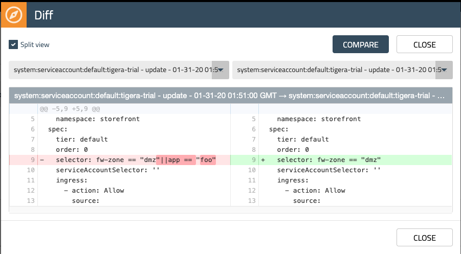

* 왼쪽 탐색 메뉴로 돌아가서 Kibana를 선택합니다. 이제 Calico Enterprise가 생성하는 모든 감사 로그 데이터를 살펴보겠습니다. Kibana의 왼쪽 탐색 메뉴에서 대시보드를 선택한 다음 "Tigera Secure EE 감사 로그"를 선택합니다.
* Kibana의 일부 감사 로그 항목과 각 항목에 대해 제공되는 세부 정보를 살펴보십시오. 이 데이터는 프로덕션 환경 모니터링, 권한 있는 액세스 모니터링 등의 사용 사례에 대한 경고를 생성하는 데 사용할 수 있습니다.

### 마무리

Kubernetes 플랫폼을 운영하는 가장 기본적인 구성 요소 중 하나는 기존 인프라에 존재하는 것과 동일한 보안 및 규정 준수 요구 사항을 구현할 수 있는 도구를 보유하는 것입니다. 이 실습에서는 Calico Enterprise의 기능을 사용하여 영역 기반 정책을 구현하고, 서비스 계정과 우선 순위가 높은 계층을 활용하여 PCI 규정 준수를 시행하고, 강력한 규정 준수 보고 및 감사를 살펴보았습니다.

실험실 설정에서 자유롭게 Calico Enterprise를 탐색하십시오.
