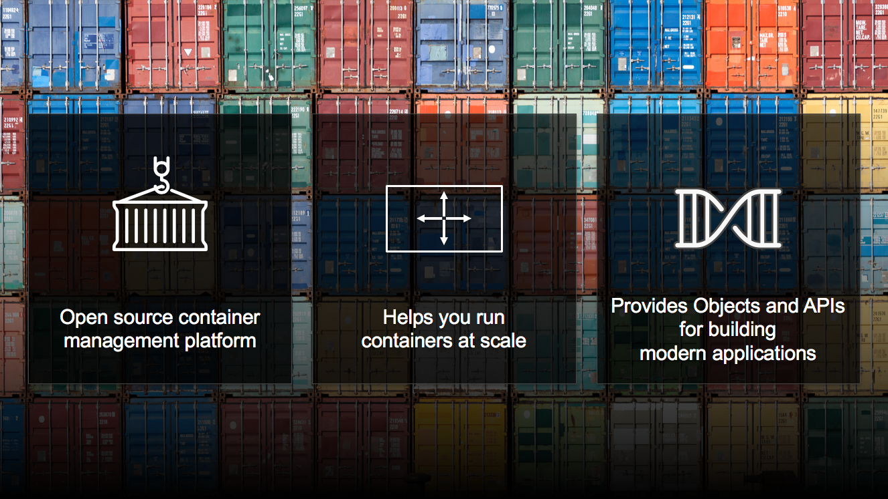
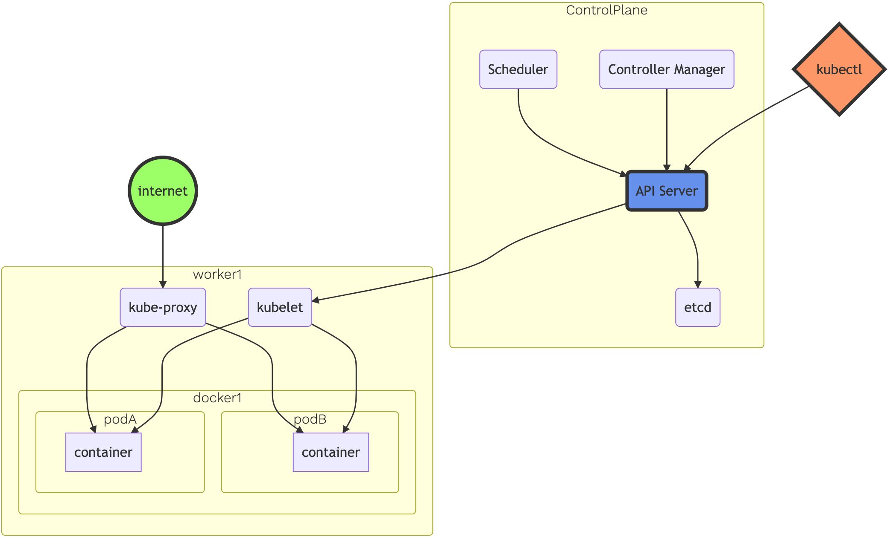
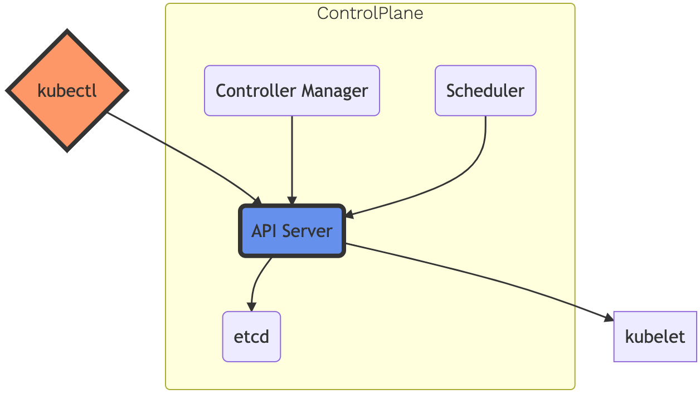
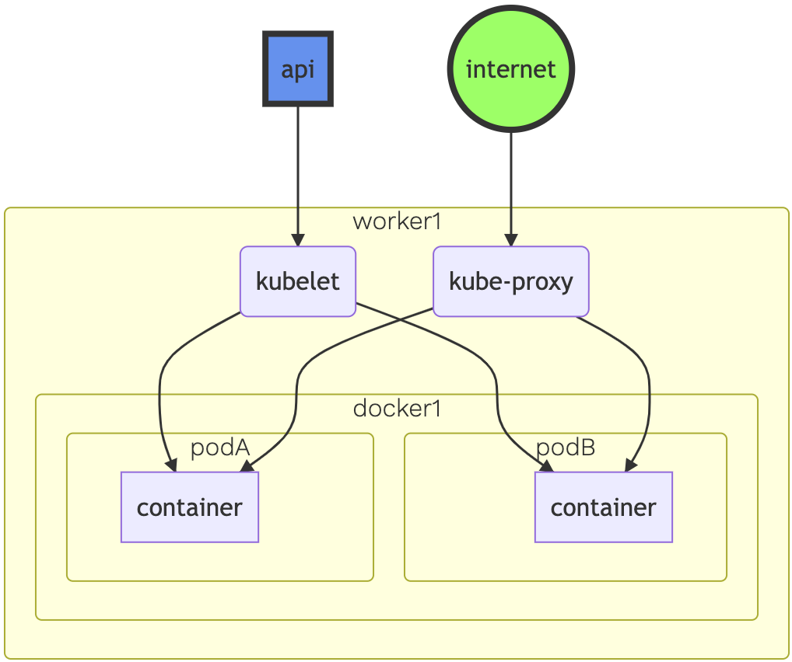
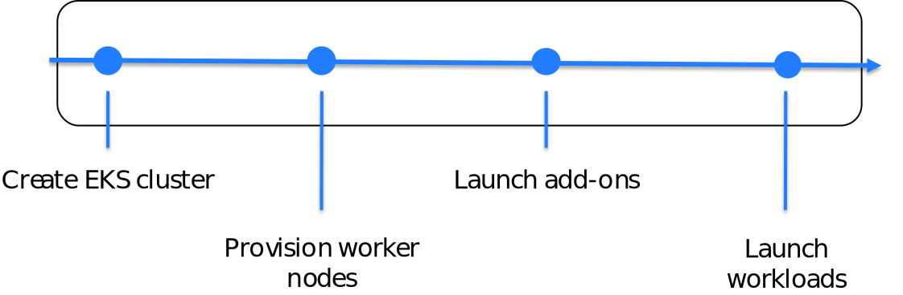
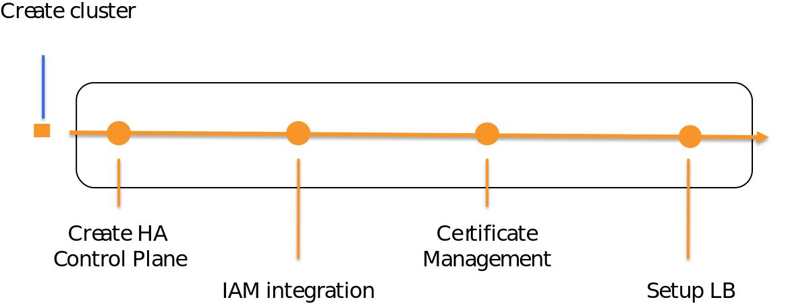

# 쿠버네티스 소개

기본 Kubernetes 개념을 살펴봅니다.

Amazon EKS 워크샵에 오신 것을 환영합니다!

이 워크샵의 목적은 사용자에게 Amazon EKS의 기능을 교육하는 것입니다.

EKS, Kubernetes, Docker 및 컨테이너 워크플로에 대한 배경 지식은 필요하지 않지만 권장됩니다.

이 장에서는 워크샵의 실습 부분을 위한 토대를 마련하는 Kubernetes의 기본 작동을 소개합니다.

구체적으로 다음 주제를 안내해 드립니다.

Kubernetes(k8s) 기본 사항
쿠버네티스 아키텍처
아마존 EKS

## KUBERNETES(K8S) 기본 사항
이 섹션에서는 다음 주제를 다룹니다.

쿠버네티스란?
쿠버네티스 노드
K8s 개체 개요
K8s 개체 세부 정보(1/2)
K8s 개체 세부 정보(2/2)

## 쿠버네티스란?

10년 이상의 경험과 모범 사례를 바탕으로 구축
선언적 구성 및 자동화 활용
도구, 서비스, 지원의 대규모 에코시스템 활용
Kubernetes가 무엇인지에 대한 자세한 내용은 공식 쿠버네티스 웹사이트.

## 쿠버네티스 노드
Kubernetes 클러스터를 구성하는 머신을 노드 라고 합니다.

Kubernetes 클러스터의 노드는 물리적 또는 가상일 수 있습니다.

노드에는 두 가지 유형이 있습니다.

구성하는 Control-plane-node 유형 제어 평면, 클러스터의 "두뇌" 역할을 합니다.

구성하는 작업자 노드 유형 데이터 플레인, 실제 컨테이너 이미지를 실행합니다(포드를 통해).

나중에 프레젠테이션에서 노드가 서로 상호 작용하는 방식에 대해 더 자세히 알아볼 것입니다.

## K8S 개체 개요
Kubernetes 개체는 클러스터의 상태를 나타내는 데 사용되는 엔터티입니다.

객체는 "의도 기록"입니다. 일단 생성되면 클러스터는 정의된 대로 존재하도록 최선을 다합니다. 이를 클러스터의 "원하는 상태"라고 합니다.

Kubernetes는 항상 개체의 "현재 상태"를 개체의 "원하는 상태"와 동일하게 만들기 위해 노력하고 있습니다. 원하는 상태는 다음을 설명할 수 있습니다.

실행 중인 포드(컨테이너)와 노드
컨테이너의 논리적 그룹에 매핑되는 IP 끝점
실행 중인 컨테이너 복제본 수
그리고 훨씬 더…
이 k8 객체를 좀 더 자세히 설명하겠습니다...

## K8S 개체 세부 정보(1/2)
현물 상환 지불
하나 이상의 컨테이너 주위에 얇은 래퍼
데몬셋
작업자 노드에서 포드의 단일 인스턴스를 구현합니다.
전개
애플리케이션 버전 간에 롤아웃(또는 롤백)하는 방법을 자세히 설명합니다.

## K8S 개체 세부 정보(2/2)
레플리카세트
정의된 수의 포드가 항상 실행되도록 합니다.
직업
포드가 완료될 때까지 제대로 실행되도록 합니다.
서비스
고정 IP 주소를 논리적 포드 그룹에 매핑합니다.
상표
연결 및 필터링에 사용되는 키/값 쌍

## 쿠버네티스 아키텍처
이 섹션에서는 다음 주제를 다룹니다.

아키텍처 개요
제어 평면
데이터 플레인
쿠버네티스 클러스터 설정

## 아키텍처 개요

## 제어 평면

하나 이상의 API 서버: REST/kubectl의 진입점

etcd: 분산 키/값 저장소

컨트롤러 관리자: 항상 현재 상태와 원하는 상태를 비교 평가

스케줄러: 작업자 노드에 팟(Pod)을 스케줄링합니다.

체크 아웃 공식 Kubernetes 문서 컨트롤 플레인 구성 요소에 대한 자세한 설명은

## 데이터 플레인

작업자 노드로 구성

kubelet: API 서버와 노드 사이의 통로 역할

kube-proxy: IP 변환 및 라우팅 관리

체크 아웃 공식 Kubernetes 문서 데이터 플레인 구성 요소에 대한 자세한 설명은

## 쿠버네티스 클러스터 설정
관리형 Amazon EKS 솔루션 외에도 자체 관리형 Kubernetes 클러스터를 부트스트랩하고 구성하는 데 사용할 수 있는 많은 도구가 있습니다. 여기에는 다음이 포함됩니다.

미니쿠베 – 개발 및 학습
콥스 – 학습, 개발, 생산
Kubeadm – 학습, 개발, 생산
Mac용 도커 - 학습, 개발
쿠버네티스 IN 도커 - 학습, 개발
이러한 오픈 소스 솔루션 외에도 많은 상용 옵션을 사용할 수 있습니다.

Amazon EKS를 살펴보겠습니다!

## 아마존 EKS
이 섹션에서는 다음 주제를 다룹니다.

EKS 클러스터 생성 워크플로
EKS 클러스터를 생성하면 어떻게 되나요?
제어 평면 및 작업자 노드 통신을 위한 EKS 아키텍처
높은 레벨
아마존 EKS!

## EKS 클러스터 생성 워크플로

## EKS 클러스터를 생성하면 어떻게 되나요?

## 제어 평면 및 작업자 노드 통신을 위한 EKS 아키텍처

## 높은 레벨
EKS 클러스터가 준비되면 API 엔드포인트를 얻고 커뮤니티에서 개발한 도구인 Kubectl을 사용하여 클러스터와 상호 작용합니다.

## 아마존 EKS!
다음 모듈에서 EKS와 함께 여정을 계속하는 동안 계속 지켜봐 주십시오!

항상 질문하세요! 이 워크숍 중 또는 다음을 통해 액세스할 수 있는 공식 Kubernetes Slack 채널에서 언제든지 직접 질문하세요. http://slack.k8s.io/.
