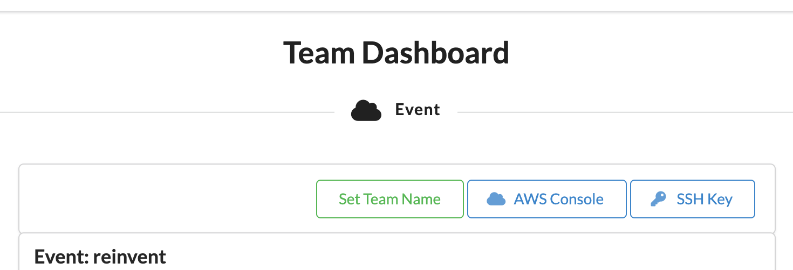
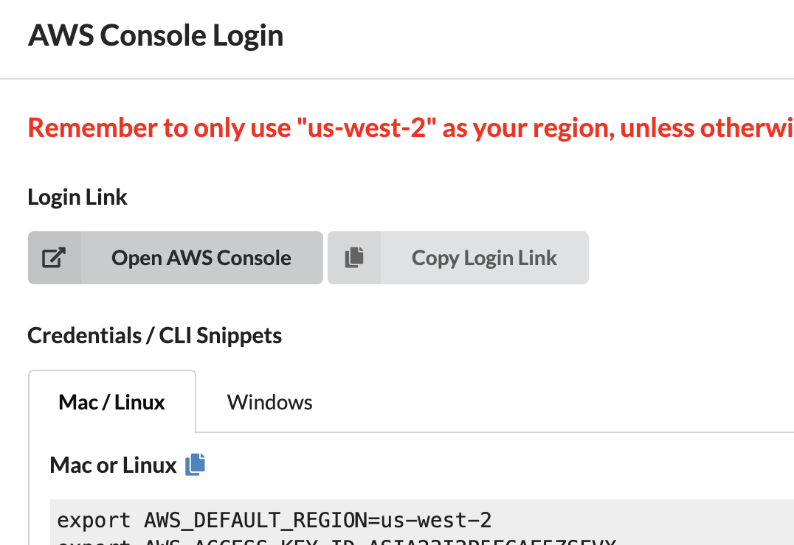
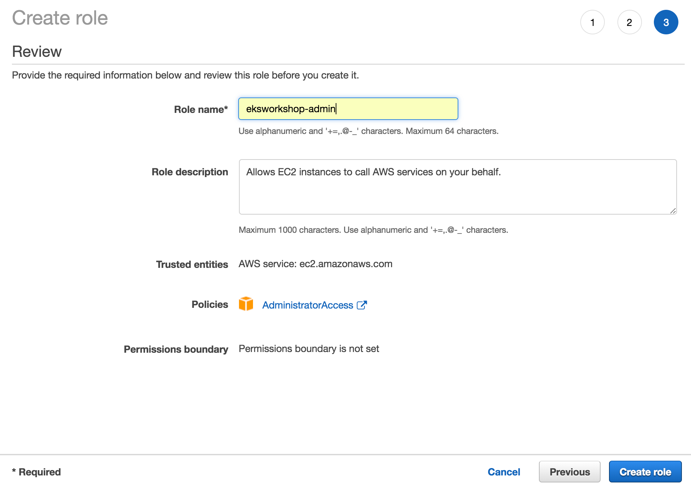
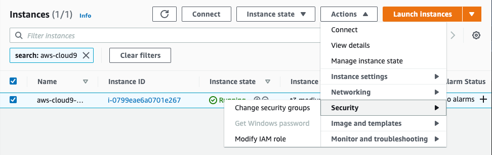
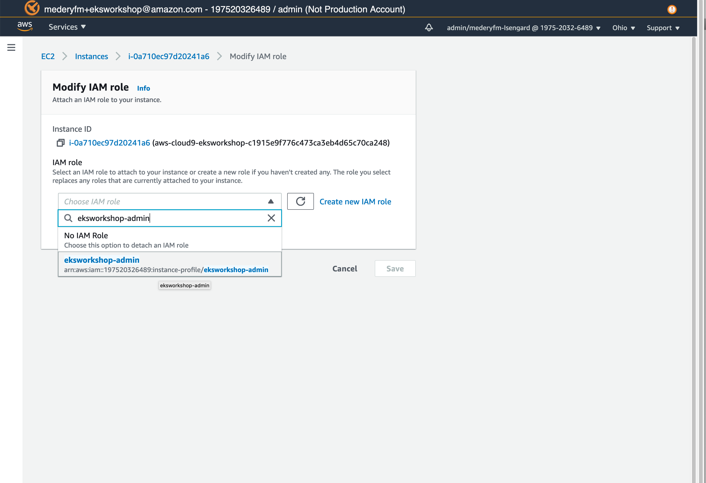

# 시작하기

LAB을 시작하려면 다음 중 하나를 수행하십시오.

…자신의 계정으로 LAB 운영, 또는 …AWS 호스팅 이벤트 참석(AWS 제공 해시 사용) 두 설정 중 하나를 완료했으면 다음을 계속하십시오. 작업 공간 생성

## LAB을 직접 운영

LAB을 직접 운영하는 경우에만 이 섹션을 완료하십시오. AWS에서 주최하는 이벤트(예: re:Invent, Kubecon, Immersion Day 등)에 있는 경우 다음으로 이동하십시오.AWS 이벤트에서 LAB 시작.

AWS 계정 생성

## AWS 계정 생성

```
계정에 새 IAM 역할을 생성하고 다른 IAM 권한의 범위를 지정할 수 있는 기능이 있어야 합니다.
```

1. 관리자 액세스 권한이 있는 AWS 계정이 아직 없는 경우: 여기를 클릭하여 지금 생성
2. AWS 계정이 있으면 AWS 계정에 대한 관리자 액세스 권한이 있는 IAM 사용자로서 나머지 워크샵 단계를 따르고 있는지 확인하십시오. 워크샵에 사용할 새 IAM 사용자 생성
3. 사용자 세부 정보 입력:


1. AdministratorAccess IAM 정책을 연결합니다.


1. 새 사용자를 만들려면 클릭하십시오.


1. 로그인 URL을 기록해 두고 다음을 저장합니다.


## AWS 이벤트에서 워크샵 진행

AWS에서 주최하는 이벤트(예: re:Invent, Kubecon, Immersion Day 또는 AWS 직원이 주최하는 기타 이벤트)에 참석하는 경우에만 이 섹션을 작성하십시오. 워크샵을 직접 운영하는 경우 다음으로 이동하십시오.

직접 워크샵 시작.

AWS 워크샵 포털

## AWS 워크샵 포털

AWS Workshop 포털에 로그인 이 워크샵은 AWS 계정과 Cloud9 환경을 생성합니다. 입장 시 제공된 참가자 해시 와 고유한 세션을 추적하려면 이메일 주소가 필요합니다.

버튼을 클릭하거나 검색하여 포털에 연결합니다. https://dashboard.eventengine.run/ 다음 화면이 나타납니다.


텍스트 상자에 제공된 해시를 입력합니다. 오른쪽 하단에 있는 버튼이 약관 동의 및 로그인 으로 변경됩니다 . 계속하려면 해당 버튼을 클릭하십시오.



대시보드 에서 AWS 콘솔 을 클릭합니다 .



기본값을 사용하고 AWS 콘솔 열기를 클릭합니다 . 그러면 새 브라우저 탭에서 AWS 콘솔이 열립니다.

위의 단계를 완료하면 다음으로 바로 이동할 수 있습니다. 작업 공간 생성

## 작업 공간 생성

Cloud9 작업 공간은 루트 계정 사용자가 아닌 관리자 권한이 있는 IAM 사용자가 빌드해야 합니다. 루트 계정 사용자가 아닌 IAM 사용자로 로그인했는지 확인하십시오.

AWS Cloud9에 대해 지원되는 브라우저 목록이 있습니다. 여기.

Cloud9 도메인에 대해 광고 차단기, 자바스크립트 비활성화기 및 추적 차단기를 비활성화해야 합니다. 그렇지 않으면 작업 공간에 연결하는 데 영향을 받을 수 있습니다. Cloud9에는 타사 쿠키가 필요합니다. 당신은 화이트리스트에특정 도메인.

가장 가까운 지역에서 Cloud9을 시작합니다. 오리건 | 아일랜드 | 오하이오 | 싱가포르 Cloud9 환경 생성: https://us-west-2.console.aws.amazon.com/cloud9/home?region=us-west-2

* 환경 만들기 선택
* 이름을 eksworkshop 으로 지정하고 다음을 클릭합니다.
* 인스턴스 유형으로 t3.small 을 선택 하고 모든 기본값을 사용하고 환경 생성을 클릭 합니다.

문제가 발생하면 다음을 수행하여 환경을 사용자 지정합니다.

* 시작 탭 닫기


기본 작업 영역에서 새 터미널 탭 열기


하부 작업 영역 폐쇄


작업 공간은 이제 다음과 같아야 합니다.


이 워크샵의 모든 섹션을 실행하려는 경우 모든 리포지토리 및 테스트에 사용할 수 있는 스토리지를 더 많이 확보하는 것이 좋습니다.

Cloud9 인스턴스에서 디스크 크기 늘리기 다음 명령은 Cloud9가 실행되는 EC2 인스턴스의 루트 볼륨에 더 많은 디스크 공간을 추가합니다. 명령이 완료되면 인스턴스를 재부팅하고 IDE가 다시 온라인 상태가 되는 데 1\~2분 정도 걸릴 수 있습니다.

```
pip3 install --user --upgrade boto3
export instance_id=$(curl -s http://169.254.169.254/latest/meta-data/instance-id)
python -c "import boto3
import os
from botocore.exceptions import ClientError 
ec2 = boto3.client('ec2')
volume_info = ec2.describe_volumes(
    Filters=[
        {
            'Name': 'attachment.instance-id',
            'Values': [
                os.getenv('instance_id')
            ]
        }
    ]
)
volume_id = volume_info['Volumes'][0]['VolumeId']
try:
    resize = ec2.modify_volume(    
            VolumeId=volume_id,    
            Size=30
    )
    print(resize)
except ClientError as e:
    if e.response['Error']['Code'] == 'InvalidParameterValue':
        print('ERROR MESSAGE: {}'.format(e))"
if [ $? -eq 0 ]; then
    sudo reboot
fi
```

## KUBERNETES 도구 설치

Amazon EKS 클러스터에는 Kubernetes 클러스터에 대한 IAM 인증을 허용하기 위해 kubectl 및 kubelet 바이너리와 aws-cli 또는 aws-iam-authenticator 바이너리가 필요합니다.

이 워크샵에서는 Linux 바이너리를 다운로드하는 명령을 제공합니다. Mac OSX/Windows를 실행 중인 경우다운로드 링크는 공식 EKS 문서를 참조하십시오.

kubectl 설치

```
sudo curl --silent --location -o /usr/local/bin/kubectl \
   https://amazon-eks.s3.us-west-2.amazonaws.com/1.19.6/2021-01-05/bin/linux/amd64/kubectl

sudo chmod +x /usr/local/bin/kubectl
```

awscli 업데이트 AWS 문서의 지침에 따라 AWS CLI를 업그레이드하십시오.

```
sudo pip install --upgrade awscli && hash -r
```

jq, envsubst(GNU gettext 유틸리티에서) 및 bash-completion 설치

```
sudo yum -y install jq gettext bash-completion moreutils
```

yaml 처리를 위해 yq 설치

```
echo 'yq() {
  docker run --rm -i -v "${PWD}":/workdir mikefarah/yq "$@"
}' | tee -a ~/.bashrc && source ~/.bashrc
```

바이너리가 경로에 있고 실행 가능한지 확인하십시오.

```
for command in kubectl jq envsubst aws
  do
    which $command &>/dev/null && echo "$command in path" || echo "$command NOT FOUND"
  done
```

kubectl bash\_completion 활성화

```
kubectl completion bash >>  ~/.bash_completion
. /etc/profile.d/bash_completion.sh
. ~/.bash_completion
```

AWS 로드 밸런서 컨트롤러 버전 설정

```
echo 'export LBC_VERSION="v2.2.0"' >>  ~/.bash_profile
.  ~/.bash_profile
```

## 작업 공간에 대한 IAM 역할 생성

1. 관리자 액세스 권한이 있는 IAM 역할을 생성하기 위한 이 딥 링크를 따르다.
2. AWS 서비스 및 EC2 가 선택 되었는지 확인하고 다음: 권한 을 클릭 하여 권한 을 봅니다.
3. AdministratorAccess 가 선택 되었는지 확인하고 다음: 태그 를 클릭 하여 태그 를 할당합니다.
4. 기본값을 사용하고 다음: 검토 를 클릭 하여 검토합니다.
5. 이름에 eksworkshop-admin 을 입력 하고 역할 생성 을 클릭 합니다.



## 작업 공간에 IAM 역할 연결

1. 오른쪽 상단 모서리에 있는 회색 원 버튼을 클릭하고 EC2 인스턴스 관리를 선택 합니다.


1. 인스턴스를 선택한 다음 작업 / 보안 / IAM 역할 수정 을 선택합니다.



1. 선택 eksworkshop-관리자 로부터 IAM 역할을 드롭 다운 선택 저장c9attachrole



## 작업 공간에 대한 IAM 설정 업데이트

Cloud9은 일반적으로 IAM 자격 증명을 동적으로 관리합니다. 이것은 현재 EKS IAM 인증과 호환되지 않으므로 이를 비활성화하고 대신 IAM 역할에 의존합니다.

Cloud9 작업 공간으로 돌아가 톱니바퀴 아이콘(오른쪽 상단)을 클릭합니다. AWS 설정 선택 AWS 관리형 임시 자격 증명 끄기 기본 설정 탭 닫기


임시 자격 증명이 아직 없는지 확인하기 위해 기존 자격 증명 파일도 제거합니다.

```
rm -vf ${HOME}/.aws/credentials
```

현재 리전을 기본값으로 사용하여 aws cli를 구성해야 합니다.

당신이있는 경우 AWS 이벤트에서, 강사 에게 사용할 AWS 리전 을 문의하십시오 .

```
export ACCOUNT_ID=$(aws sts get-caller-identity --output text --query Account)
export AWS_REGION=$(curl -s 169.254.169.254/latest/dynamic/instance-identity/document | jq -r '.region')
export AZS=($(aws ec2 describe-availability-zones --query 'AvailabilityZones[].ZoneName' --output text --region $AWS_REGION))
```

AWS\_REGION이 원하는 지역으로 설정되어 있는지 확인

```
test -n "$AWS_REGION" && echo AWS_REGION is "$AWS_REGION" || echo AWS_REGION is not set
```

bash\_profile에 저장하자

```
echo "export ACCOUNT_ID=${ACCOUNT_ID}" | tee -a ~/.bash_profile
echo "export AWS_REGION=${AWS_REGION}" | tee -a ~/.bash_profile
echo "export AZS=(${AZS[@]})" | tee -a ~/.bash_profile
aws configure set default.region ${AWS_REGION}
aws configure get default.region
```

IAM 역할 검증 사용 GetCallerIdentity Cloud9 IDE가 올바른 IAM 역할을 사용하고 있는지 확인하는 CLI 명령.

```
aws sts get-caller-identity --query Arn | grep eksworkshop-admin -q && echo "IAM role valid" || echo "IAM role NOT valid"
```

IAM 역할이 유효하지 않으면 DO NOT PROCEED . 돌아가서 이 페이지의 단계를 확인하십시오.

## 서비스 저장소 복제

```
cd ~/environment
git clone https://github.com/aws-containers/ecsdemo-frontend.git
git clone https://github.com/brentley/ecsdemo-nodejs.git
git clone https://github.com/brentley/ecsdemo-crystal.git
```

## AWS KMS 사용자 지정 관리형 키(CMK) 생성

Kubernetes 비밀을 암호화할 때 사용할 EKS 클러스터용 CMK를 생성합니다.

```
aws kms create-alias --alias-name alias/eksworkshop --target-key-id $(aws kms create-key --query KeyMetadata.Arn --output text)
```

create cluster 명령에 입력할 CMK의 ARN을 검색해 보겠습니다.

```
export MASTER_ARN=$(aws kms describe-key --key-id alias/eksworkshop --query KeyMetadata.Arn --output text)
```

나중에 KMS 키를 더 쉽게 참조할 수 있도록 MASTER\_ARN 환경 변수를 설정했습니다.

이제 MASTER\_ARN 환경 변수를 bash\_profile에 저장해 보겠습니다.

```
echo "export MASTER_ARN=${MASTER_ARN}" | tee -a ~/.bash_profile
```
